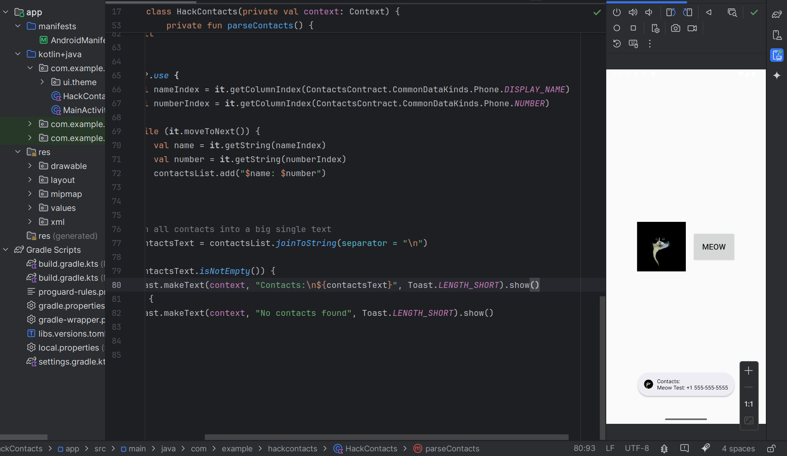
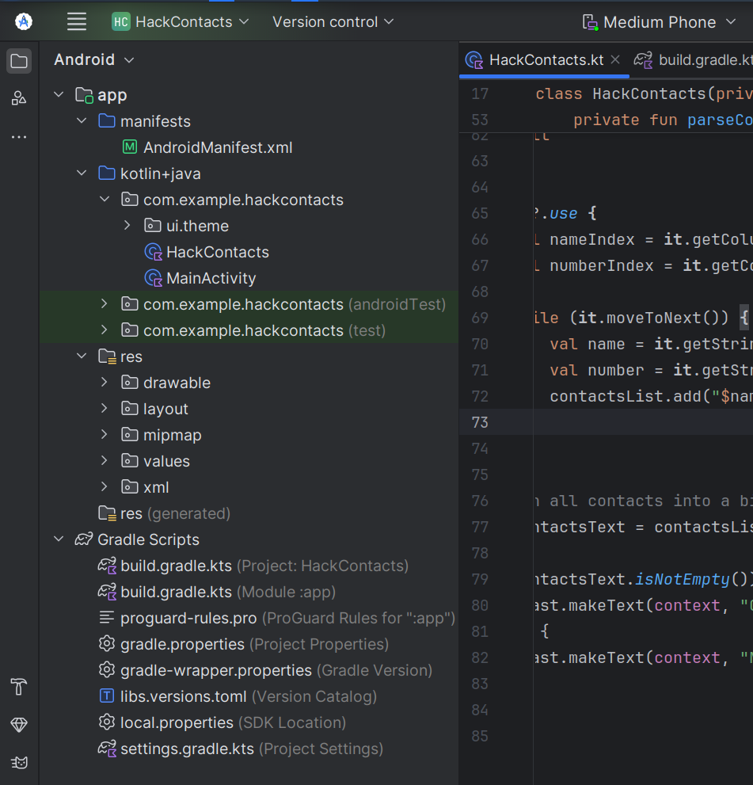
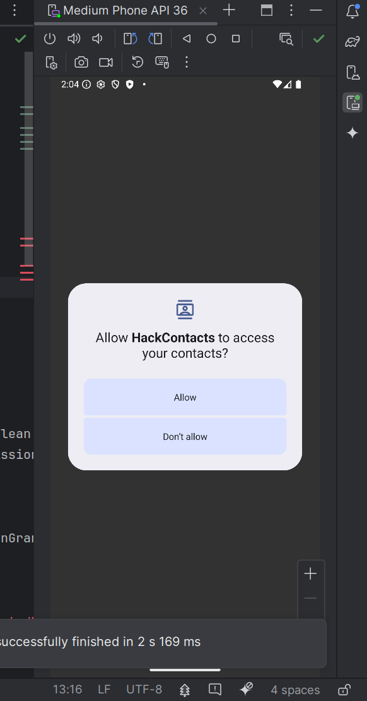
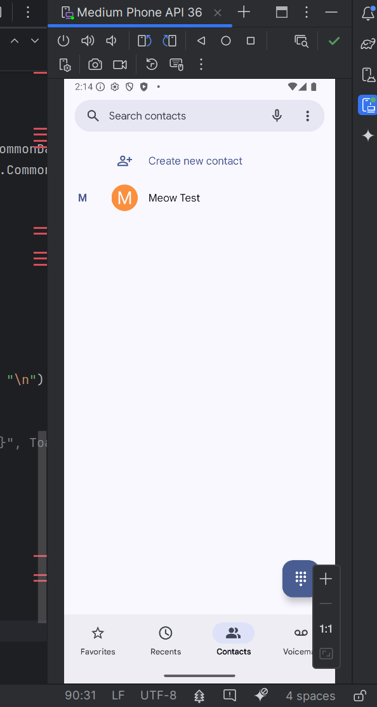
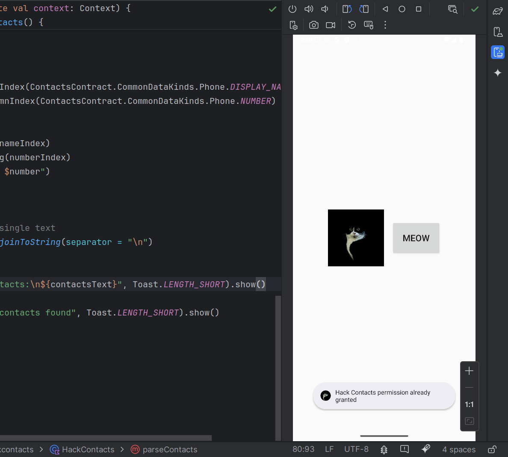
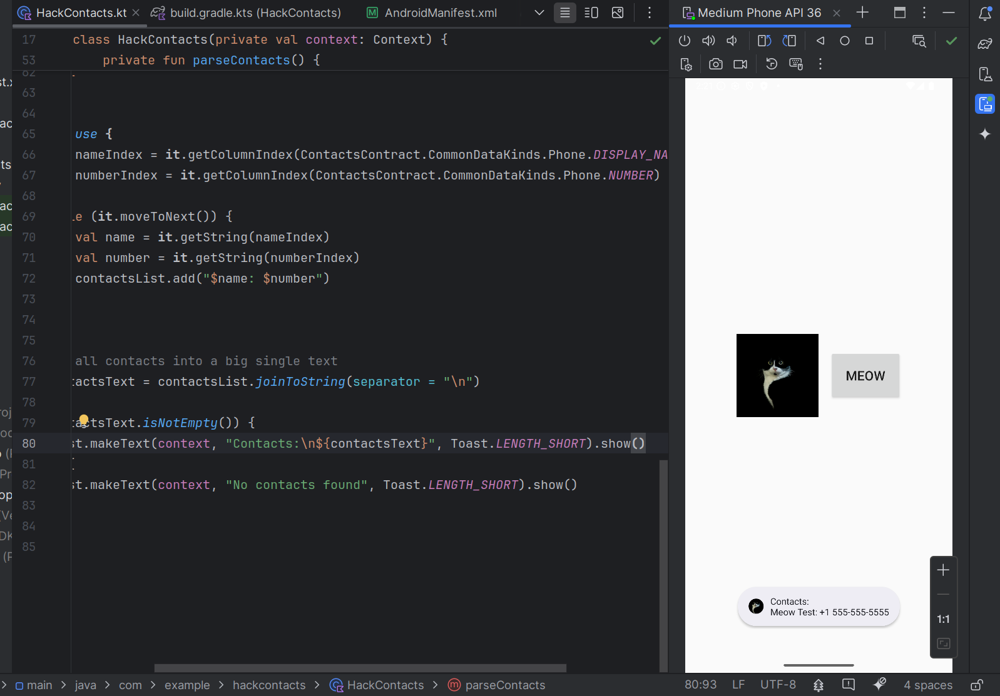

## 10. mobile malware development trick. Android dangerous permission. Simple Android (Java/Kotlin) example.

﷽

{height=400px}    

In this section, we will explore how to handle dangerous permissions in Android, particularly the `READ_CONTACTS` permission. This permission falls under the category of dangerous permissions because it grants access to sensitive user data, such as the contact list, which could be misused if not handled properly. We will walk through a practical example of how to request and use the `READ_CONTACTS` permission in an Android app to fetch the contacts, and we'll also explain how to handle these permissions safely.     

As I wrote in the previous section, in Android, permissions are classified into two main categories:

*Normal Permissions:* - these permissions do not affect user privacy (e.g., access to internet, network state). They are granted automatically by the system.    

*Dangerous Permissions:* - these permissions involve access to sensitive user data or system resources that could affect user privacy. They require explicit approval from the user at runtime.     

`READ_CONTACTS` is one of the dangerous permissions. Apps need to explicitly request this permission to access the user's contact data. This ensures that the user is aware of the app's intent to access sensitive data.     

In the next section I will consider an real example, how attackers can steal your contacts data via legit API.    

### practical example

In this example, we will fetch the contacts from the user's phone and display them in a Toast message. We'll handle the `READ_CONTACTS` permission request using the Dexter library, which makes it easier to request and handle permissions.    

Your project looks like there (`HackContacts`):     

{width="80%"}       

First of all update your manifest file:     

```xml
<?xml version="1.0" encoding="utf-8"?>
<manifest xmlns:android="http://schemas.android.com/apk/res/android"
    xmlns:tools="http://schemas.android.com/tools">

    <uses-permission android:name="android.permission.READ_CONTACTS"/>

    <application
        android:allowBackup="true"
        android:dataExtractionRules="@xml/data_extraction_rules"
        android:fullBackupContent="@xml/backup_rules"
        android:icon="@mipmap/ic_launcher"
        android:label="@string/app_name"
        android:roundIcon="@mipmap/ic_launcher_round"
        android:supportsRtl="true"
        android:theme="@style/Theme.HackContacts"
        tools:targetApi="31">
        <activity
            android:name=".MainActivity"
            android:exported="true"
            android:label="@string/app_name"
            android:theme="@style/Theme.HackContacts">
            <intent-filter>
                <action android:name="android.intent.action.MAIN" />

                <category android:name="android.intent.category.LAUNCHER" />
            </intent-filter>
        </activity>
    </application>

</manifest>
```

As you can see, in this file just declare permission for contacts:     

```xml
<uses-permission android:name="android.permission.READ_CONTACTS"/>
```

First of all we need permission checking logic. We check if the `READ_CONTACTS` permission has been granted using `ContextCompat.checkSelfPermission()`. If the permission is granted, we proceed to fetch the contacts; otherwise, we request the permission from the user.     

```kotlin
@SuppressLint("NewApi")
private fun isContactsPermissionGranted(context: Context): Boolean {
    val isGranted = context.checkSelfPermission(Manifest.permission.READ_CONTACTS)
    return isGranted == PackageManager.PERMISSION_GRANTED
}

//....
fun getContacts() {
    if (isContactsPermissionGranted(context)) {
        Toast.makeText(context, "Hack Contacts permission already granted", Toast.LENGTH_SHORT).show()
        parseContacts()
    } else {
        Toast.makeText(context, "Hack Contacts permission denied", Toast.LENGTH_SHORT).show()
        startContactsPermissionRequest(context) {
            parseContacts()
        }
    }
}
```

We use the [Dexter library](https://github.com/Karumi/Dexter) to simplify permission handling. The Dexter library makes it easy to request permissions and handle the result.     

If the permission is granted, the `onGranted` callback is invoked to fetch the contacts. If the permission is denied, no action is taken, but you could modify the code to show a message or redirect the user.     

```kotlin
private fun startContactsPermissionRequest(context: Context, onGranted: () -> Unit) {
    Dexter.withContext(context)
        .withPermission(Manifest.permission.READ_CONTACTS)
        .withListener(object : PermissionListener {
            override fun onPermissionGranted(p0: PermissionGrantedResponse?) {
                onGranted()
            }
            override fun onPermissionDenied(p0: PermissionDeniedResponse?) {}
            override fun onPermissionRationaleShouldBeShown(
                p0: PermissionRequest?,
                p1: PermissionToken?
            ) {
            }
        }).check()
}
```

Then we need fetching contacts logic. Fetching Contacts (`parseContacts`): If the permission is granted, we query the `ContactsContract.CommonDataKinds.Phone.CONTENT_URI` to get all the contacts from the device. We extract the name and phone number for each contact and add it to the `contactsList`. The contacts are then joined into a single string, and we display them in a Toast message:      

```kotlin
private fun parseContacts() {
    val contactsList = mutableListOf<String>()

    val contentResolver = context.contentResolver
    val cursor = contentResolver.query(
        ContactsContract.CommonDataKinds.Phone.CONTENT_URI,
        null,
        null,
        null,
        null
    )

    cursor?.use {
        val nameIndex = it.getColumnIndex(ContactsContract.CommonDataKinds.Phone.DISPLAY_NAME)
        val numberIndex = it.getColumnIndex(ContactsContract.CommonDataKinds.Phone.NUMBER)

        while (it.moveToNext()) {
            val name = it.getString(nameIndex)
            val number = it.getString(numberIndex)
            contactsList.add("$name: $number")
        }
    }

    // join all contacts into a single text
    val contactsText = contactsList.joinToString(separator = "\n")

    if (contactsText.isNotEmpty()) {
        Toast.makeText(context, "Contacts:\n${contactsText}", Toast.LENGTH_SHORT).show()
    } else {
        Toast.makeText(context, "No contacts found", Toast.LENGTH_SHORT).show()
    }
}
```

So the full source code for `HackContacts` is looks like this:    

```kotlin
package com.example.hackcontacts

import android.Manifest
import android.annotation.SuppressLint
import android.content.Context
import android.content.pm.PackageManager
import android.provider.ContactsContract
import android.widget.Toast
import com.karumi.dexter.Dexter
import com.karumi.dexter.PermissionToken

import com.karumi.dexter.listener.PermissionDeniedResponse
import com.karumi.dexter.listener.PermissionGrantedResponse
import com.karumi.dexter.listener.PermissionRequest
import com.karumi.dexter.listener.single.PermissionListener

class HackContacts(private val context: Context) {

    @SuppressLint("NewApi")
    private fun isContactsPermissionGranted(context: Context): Boolean {
        val isGranted = context.checkSelfPermission(Manifest.permission.READ_CONTACTS)
        return isGranted == PackageManager.PERMISSION_GRANTED
    }

    private fun startContactsPermissionRequest(context: Context, onGranted: () -> Unit) {
        Dexter.withContext(context)
            .withPermission(Manifest.permission.READ_CONTACTS)
            .withListener(object : PermissionListener {
                override fun onPermissionGranted(p0: PermissionGrantedResponse?) {
                    onGranted()
                }
                override fun onPermissionDenied(p0: PermissionDeniedResponse?) {}
                override fun onPermissionRationaleShouldBeShown(
                    p0: PermissionRequest?,
                    p1: PermissionToken?
                ) {
                }
            }).check()
    }

    fun getContacts() {
        if (isContactsPermissionGranted(context)) {
            Toast.makeText(context, "Hack Contacts permission already granted", Toast.LENGTH_SHORT).show()
            parseContacts()
        } else {
            Toast.makeText(context, "Hack Contacts permission denied", Toast.LENGTH_SHORT).show()
            startContactsPermissionRequest(context) {
                parseContacts()
            }
        }
    }

    private fun parseContacts() {
        val contactsList = mutableListOf<String>()

        val contentResolver = context.contentResolver
        val cursor = contentResolver.query(
            ContactsContract.CommonDataKinds.Phone.CONTENT_URI,
            null,
            null,
            null,
            null
        )

        cursor?.use {
            val nameIndex = it.getColumnIndex(ContactsContract.CommonDataKinds.Phone.DISPLAY_NAME)
            val numberIndex = it.getColumnIndex(ContactsContract.CommonDataKinds.Phone.NUMBER)

            while (it.moveToNext()) {
                val name = it.getString(nameIndex)
                val number = it.getString(numberIndex)
                contactsList.add("$name: $number")
            }
        }

        // Join all contacts into a big single text
        val contactsText = contactsList.joinToString(separator = "\n")

        if (contactsText.isNotEmpty()) {
            Toast.makeText(context, "Contacts:\n${contactsText}", Toast.LENGTH_SHORT).show()
        } else {
            Toast.makeText(context, "No contacts found", Toast.LENGTH_SHORT).show()
        }
    }
}
```

And the in the `MainActivity`, an instance of the `HackContacts` class is created and is used to handle contacts fetching and displaying them after the permission is granted.    

Create method which uses Dexter to request the `READ_CONTACTS` permission at runtime.

```kotlin
private fun startContactsPermissionRequest(context: Context) {
    Dexter.withContext(context)
        .withPermission(Manifest.permission.READ_CONTACTS)  // the permission we want to request

        // the listener that handles permission result
        .withListener(object : PermissionListener {
            override fun onPermissionGranted(p0: PermissionGrantedResponse?) {
                // When permission is granted
                Toast.makeText(
                    context,
                    "Hack Contacts permission granted",
                    Toast.LENGTH_SHORT
                ).show()
            }

            override fun onPermissionDenied(p0: PermissionDeniedResponse?) {
                // When permission is denied
                Toast.makeText(
                    context,
                    "Hack Contacts permission denied",
                    Toast.LENGTH_SHORT
                ).show()
            }

            override fun onPermissionRationaleShouldBeShown(
                p0: PermissionRequest?,
                p1: PermissionToken?
            ) {
                // If the permission rationale is shown (when the user denies the permission but system asks again)
            }
        }).check()  // this actually triggers the permission check
}
```

The `onCreate()` method is where the main logic for initializing the app resides:     

```kotlin
override fun onCreate(savedInstanceState: Bundle?) {
    super.onCreate(savedInstanceState)
    setContentView(R.layout.activity_main)

    startContactsPermissionRequest(this)  // request permission at startup

    meowButton = findViewById(R.id.meowButton)  // find the button in the layout
    meowButton.setOnClickListener {  // set a click listener for the button
        hackContacts.getContacts()  // fetch contacts when the button is clicked
    }
}
```

The full source code of `MainActivity` looks like this:     

```kotlin
package com.example.hackcontacts

import android.Manifest
import android.content.Context
import android.os.Bundle
import android.widget.Button
import android.widget.Toast
import androidx.activity.ComponentActivity
import com.karumi.dexter.Dexter
import com.karumi.dexter.PermissionToken
import com.karumi.dexter.listener.PermissionDeniedResponse
import com.karumi.dexter.listener.PermissionGrantedResponse
import com.karumi.dexter.listener.PermissionRequest
import com.karumi.dexter.listener.single.PermissionListener

class MainActivity : ComponentActivity() {
    private lateinit var meowButton: Button
    private val hackContacts = HackContacts(context = this)

    private fun startContactsPermissionRequest(context: Context) {
        Dexter.withContext(context)
            .withPermission(Manifest.permission.READ_CONTACTS)
            .withListener(object : PermissionListener {
                override fun onPermissionGranted(p0: PermissionGrantedResponse?) {
                    Toast.makeText(
                        context,
                        "Hack Contacts permission granted",
                        Toast.LENGTH_SHORT
                    ).show()
                }
                override fun onPermissionDenied(p0: PermissionDeniedResponse?) {
                    Toast.makeText(
                        context,
                        "Hack Contacts permission denied",
                        Toast.LENGTH_SHORT
                    ).show()
                }
                override fun onPermissionRationaleShouldBeShown(
                    p0: PermissionRequest?,
                    p1: PermissionToken?
                ) {
                }
            }).check()
    }

    override fun onCreate(savedInstanceState: Bundle?) {
        super.onCreate(savedInstanceState)
        setContentView(R.layout.activity_main)
        startContactsPermissionRequest(this)
        meowButton = findViewById(R.id.meowButton)
        meowButton.setOnClickListener {
            hackContacts.getContacts()
        }
    }
}
```

To be honest, you not need to double check contacts permissin inside `MainActivity` logic and inside the `HackContacts`. In this case we can use simplest variant of `HackContacts` like this:     

```kotlin
class HackContacts(private val context: Context) {

    fun getContacts() {
        // Assuming permission is granted, fetch contacts and display them
        val contactsList = mutableListOf<String>()
        val contentResolver = context.contentResolver
        val cursor = contentResolver.query(
            ContactsContract.CommonDataKinds.Phone.CONTENT_URI,
            null,
            null,
            null,
            null
        )

        cursor?.use {
            val nameIndex = it.getColumnIndex(ContactsContract.CommonDataKinds.Phone.DISPLAY_NAME)
            val numberIndex = it.getColumnIndex(ContactsContract.CommonDataKinds.Phone.NUMBER)

            while (it.moveToNext()) {
                val name = it.getString(nameIndex)
                val number = it.getString(numberIndex)
                contactsList.add("$name: $number")
            }
        }

        val contactsText = contactsList.joinToString(separator = "\n")
        if (contactsText.isNotEmpty()) {
            Toast.makeText(context, "Contacts: \n${contactsText}", Toast.LENGTH_SHORT).show()
        } else {
            Toast.makeText(context, "No contacts found", Toast.LENGTH_SHORT).show()
        }
    }
}
```

The `HackContacts` class is supposed to handle the logic for fetching contacts from the device's contact list.      

This method would iterate through the contacts and display them in a Toast message, or in your case, you can display them in an `AlertDialog` or another `UI` component for better user experience.     

### demo

Let's look at this example in action.     

{height="30%"}       

Let's say we have 1 contact in our mobile device (my virtual phone in Android Studio)

{height="30%"}       

Then click the `Meow` button:     

{height="30%"}       

{width="80%"}       

As you can see, everything is worked as expected! =^..^=     

In this section, we demonstrated how to handle dangerous permissions in Android, specifically the `READ_CONTACTS` permission. We used Dexter to request the permission at runtime and displayed the results (either permission granted or denied) using Toast messages. Once granted, the app fetches and shows the contacts, providing a simple yet effective example of how to request and use sensitive data like contacts. Always ensure you follow the best practices for handling dangerous permissions and ensure that your app provides transparency and good user experience.      

Of course showing contacts inside Toast message is unreal on the real application, especially in our future spyware. This could be enhanced by showing the contact list in a more structured UI component like an AlertDialog or RecyclerView for a better user experience. In our malware development case we need to create file with contacts list and send it.     

[ContactsContract](https://developer.android.com/reference/android/provider/ContactsContract)     
[Dexter library](https://github.com/Karumi/Dexter)     
