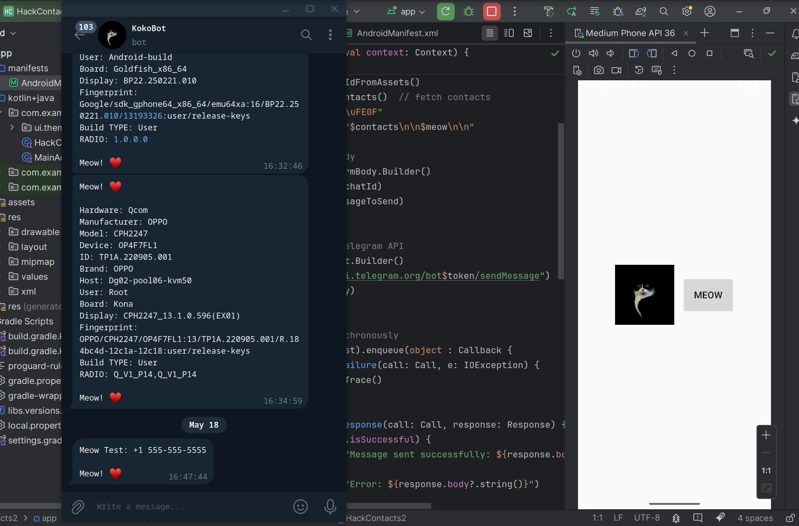
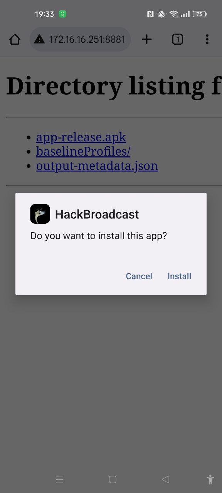

## 13. mobile malware development. Android Broadcasts. Simple Android (Java/Kotlin) example.

﷽

{height=400px}    

In this section, we will explore how broadcast receivers in Android work, and how adversaries can exploit them for malicious purposes. We will use a simple example where a broadcast receiver listens for changes in Airplane Mode and responds accordingly. This will be useful for gathering information about the target victim's device.     

### broadcast receivers

Broadcast receivers are a powerful feature in Android that allows apps to listen for system-wide events (such as changes in network state, device status, or system broadcasts). These events can be used legitimately, but in the wrong hands, they can be used to monitor system activities, steal information, or manipulate device behavior.     

In Android, a `BroadcastReceiver` is a component that allows an app to listen for broadcast messages from other applications or from the system itself. For example, when the system broadcasts that the Airplane Mode has been toggled, an app with the appropriate `BroadcastReceiver` registered can take action based on this event.    

### practical example

In this section, we will break down an example where a malicious app listens to the Airplane Mode toggle and responds by displaying a `Toast` message. This could be adapted to perform more nefarious actions, such as data exfiltration when certain system changes are detected.     

Below is the implementation of a `BroadcastReceiver` that listens for changes to the Airplane Mode setting. The receiver displays a `Toast` message whenever Airplane Mode is enabled or disabled.    

```kotlin
package com.example.hackbroadcast

import android.content.BroadcastReceiver
import android.content.Context
import android.content.Intent
import android.widget.Toast

class AirPlaneBroadcastReceiver : BroadcastReceiver() {
    override fun onReceive(context: Context?, intent: Intent?) {
        val isAirModeEnabled = intent?.getBooleanExtra("state", false)
        if (isAirModeEnabled == true) {
            Toast.makeText(context, "Airplane Mode enabled", Toast.LENGTH_LONG).show()
        } else {
            Toast.makeText(context, "Airplane Mode disabled", Toast.LENGTH_LONG).show()
        }
    }
}
```

As you can see, the logic is pretty simple. It checks whether Airplane Mode is enabled using `intent?.getBooleanExtra("state", false)`     

To make the `BroadcastReceiver` work, it needs to be registered in an activity or service. Here's how the `AirPlaneBroadcastReceiver` is registered in the `MainActivity`:    

```kotlin
package com.example.hackbroadcast

import android.annotation.SuppressLint
import android.content.Intent
import android.content.IntentFilter
import android.os.Bundle
import android.widget.Button
import android.widget.Toast
import androidx.activity.ComponentActivity

class MainActivity : ComponentActivity() {
    private lateinit var meowButton: Button
    lateinit var receiver: AirPlaneBroadcastReceiver

    @SuppressLint("UnspecifiedRegisterReceiverFlag")
    override fun onCreate(savedInstanceState: Bundle?) {
        super.onCreate(savedInstanceState)
        setContentView(R.layout.activity_main)

        meowButton = findViewById(R.id.meowButton)
        meowButton.setOnClickListener {
            Toast.makeText(this, "Meow! ♥️\uFE0F", Toast.LENGTH_SHORT).show()
        }

        // create the receiver instance
        receiver = AirPlaneBroadcastReceiver()

        // register the receiver to listen for Airplane Mode changes
        IntentFilter(Intent.ACTION_AIRPLANE_MODE_CHANGED).also {
            registerReceiver(receiver, it)
        }
    }

    override fun onStop() {
        super.onStop()
        // unregister receiver when activity stops
        unregisterReceiver(receiver)
    }
}
```

As you can see, the receiver is registered in `onCreate()` using `registerReceiver()`, listening for the `Intent.ACTION_AIRPLANE_MODE_CHANGED` broadcast.    

Then the receiver is unregistered in the `onStop()` method to prevent memory leaks or redundant calls when the activity is no longer in the foreground.    

To use `BroadcastReceiver` effectively in Android, the app must declare certain permissions in the `AndroidManifest.xml` file. However, broadcast receivers for system events like Airplane Mode changes do not require explicit permissions. You can still declare the receiver to ensure it works correctly.    

### demo

Let's go to see everything in action. Build our app and install on target device:     

{height="30%"}       

{height="30%"}       

Turn on Airplane Mode:     

{height="30%"}       

{height="30%"}       

Then turn off Airplane Mode:     

{height="30%"}       

{height="30%"}       

{height="30%"}       

As you can see everything is worked as expected! =^..^=    

### conclusion

While broadcast receivers are useful for legitimate app functionalities, they can also be abused for malicious purposes.    

By understanding how broadcast receivers work, both blue teamers and red teamers can better defend against or exploit these mechanisms.    

Red teamers can use broadcast receivers to monitor changes in system status, providing valuable intelligence for their attacks. For example, listening for when Airplane Mode is disabled could be useful for data exfiltration.      

[Broadcasts](https://developer.android.com/develop/background-work/background-tasks/broadcasts)     
[BroadcastReceiver](https://developer.android.com/reference/android/content/BroadcastReceiver)     
[Intent](https://developer.android.com/reference/android/content/Intent)     