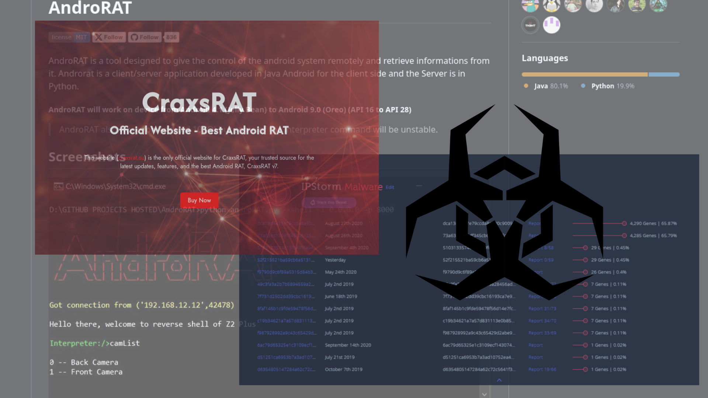

\newpage
\subsection{15. evolution of android malware: from simple to sophisticated threats}

﷽

{height=400px}    

Android malware has evolved quickly due to mobile device adoption and malicious actor capabilities. Android viruses and malware were first simple and delivered through unreliable third-party app marketplaces.  Early threats used adware, intrusive permissions, and program repackaging to distribute malware.     

Android malware has grown more sophisticated and targeted over time.  Zero-day exploits and privilege escalation were used by attackers as Android became popular. Advanced persistent threats (APTs) targeting mobile users for data theft, surveillance, and financial fraud have also caused malware to evolve.     

### some types of android malware

**SMS Trojans** are early Android malware. Many threats send premium `SMS` messages to premium services, costing victims a lot of money without their authorization. Malware typically impersonates legitimate programs or games to deceive users into installing it.    

**Adware** infections slow down devices and consume too much data to send unwanted advertisements to consumers. Adware became increasingly obtrusive, gathering personal data or sending visitors to fraudulent sites.    

**Banking Trojans** are among the most hazardous Android viruses since they steal financial credentials, banking information, and other sensitive data. Trojans impersonate legitimate banking apps or steal credentials.     

**Ransomware** (mobile ransomware) encrypts user data, locks access to the phone, or displays a ransom message demanding payment for the release of the device. While this type of malware is most commonly seen on desktop systems, Android ransomware has steadily gained prominence.    

**RAT** Among the most dangerous and sophisticated types of Android malware are Remote Access Trojans (RATs). RATs are designed to provide an attacker with remote control over the infected device, allowing them to monitor and control it without the user’s knowledge.

RATs can exploit a variety of methods to gain control of a device:    

*Keylogging* - capturing every keystroke made by the user to gather sensitive data like login credentials, credit card numbers, or other private information.     

*Surveillance* - RATs often have access to the camera and microphone, allowing attackers to spy on the user in real time.     

*Location tracking* - by exploiting location services, RATs can provide real-time GPS tracking data, enabling attackers to pinpoint the victim’s whereabouts.    

*File exfiltration* - RATs often steal files or photos from the victim’s device and send them to the attacker.     

*Credential harvesting* - Through phishing or directly accessing apps like banking apps, RATs can steal credentials for various accounts.    

*Persistence* - RATs often implement persistence techniques, ensuring they remain active on the device even after a reboot or when the user attempts to remove them.     

### notable Android malware families and their features

**AndroRAT** - [apk.androrat](https://malpedia.caad.fkie.fraunhofer.de/details/apk.androrat) - provides remote access to Android devices, allowing attackers to control the device and collect information.     

**Anubis** - [a.k.a apk.anubis, BankBot, android.bankspy](https://malpedia.caad.fkie.fraunhofer.de/details/apk.anubis) - originally used as a banking Trojan, Anubis evolved to include features for stealing credentials and other sensitive information. Key features are keylloging and remote access.     

**SpyNote** - [a.k.a apk.spynote, CypherRat](https://malpedia.caad.fkie.fraunhofer.de/details/apk.spynote) - a Remote Access Trojan that uses Android broadcast receivers to automatically start when the device boots.      

**Dendroid** - [apk.dendroid](https://malpedia.caad.fkie.fraunhofer.de/details/apk.dendroid) - a sophisticated Android RAT that was available for sale and capable of evading detection.     

**Hydra** - [apk.hydra](https://malpedia.caad.fkie.fraunhofer.de/details/apk.hydra) - a banking Trojan that targets banking applications to steal credentials.     

**FakeGram** - [apk.fakegram](https://malpedia.caad.fkie.fraunhofer.de/details/apk.faketgram) - is a banking Trojan and a RAT that targets Android devices. It is a malicious version of Telegram used for stealing user credentials, financial data, and personal information. The malware is often distributed through third-party app stores or social engineering tactics, and once installed on an Android device, it behaves like the legitimate Telegram app but with hidden malicious functionality.    

**IPStorm** - [apk.ipstorm](https://malpedia.caad.fkie.fraunhofer.de/details/apk.ipstorm) - is a sophisticated malware family that evolved from targeting Windows systems to infecting a wide range of devices, including Android, Linux, and macOS. It is primarily used to create a botnet by exploiting exposed services and weak credentials.     

**CraxsRAT** - [apk.craxs_rat](https://malpedia.caad.fkie.fraunhofer.de/details/apk.craxs_rat) - is a sophisticated Android Remote Access Trojan (RAT) developed by a Syrian threat actor known as EVLF DEV. This malware-as-a-service (MaaS) has been sold to over 100 cybercriminals worldwide, enabling them to remotely control infected Android devices and exfiltrate sensitive data.    

### conclusion

As you can see, the evolution of Android malware, especially RATs, demonstrates the increasing sophistication of mobile threats. While early Android malware was limited to relatively simple adware and SMS Trojans, modern threats like RATs provide attackers with full control over a compromised device.      