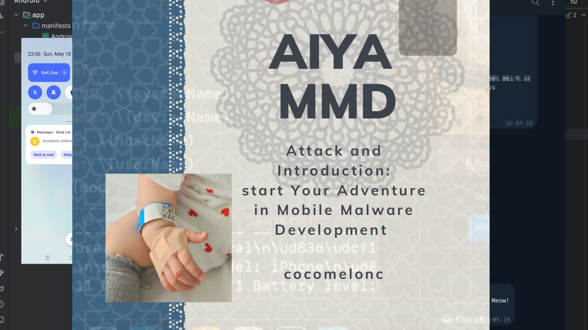

## 17. final

﷽

{width="80%"}       

Alhamdulillah, I finished writing this book in few days.     

Why is the book called that? **AIYA MMD** - means **A**ttack and **I**ntroduction or (**A**ndroid and **I**OS), start **Y**our **A**dventure in **M**obile **M**alware **D**evelopment. also **AIYA** means **AIYA** Nurkhankyzy.    

I will be very happy if this book helps at least one person to gain knowledge and learn the science of cybersecurity. The book is mostly practice oriented.    

Of course the book is not as big as my previous works, this is because firstly I needed to urgently start a fundraising campaign for the Aiya and secondly many things remain confidential (NDA)    

Mobile malware - it's a constantly evolving battlefield. What you learned here is just the beginning. Tools change, defenses adapt, but the mindset stays the same: think like the adversary to build stronger defenses.     

Experiment responsibly, push boundaries, and never stop digging deeper. The mobile world is vast, complex, and full of opportunity - for both attackers and defenders. Keep your skills sharp, your curiosity alive, and remember: knowledge is the ultimate weapon. Stay sharp, stay curious, and stay one step ahead.     

This book is dedicated to my wife, Laura, and my children, Yerzhan and Munira. I would like to express my deep gratitude to my friends and colleagues.     

Special thanks to Russian hacking community, 2600.kz, BlackIce hackerspace from Almaty (Kazakhstan) and my friends from Middle East countries: Kingdom of Bahrain, Kingdom of Saudi Arabia, UAE.      

All examples are practical cases for educational and research purposes only.      
Book design by: Muhammad Patel
Thanks for your time happy hacking and good bye!   
*PS. All drawings and screenshots are mine*