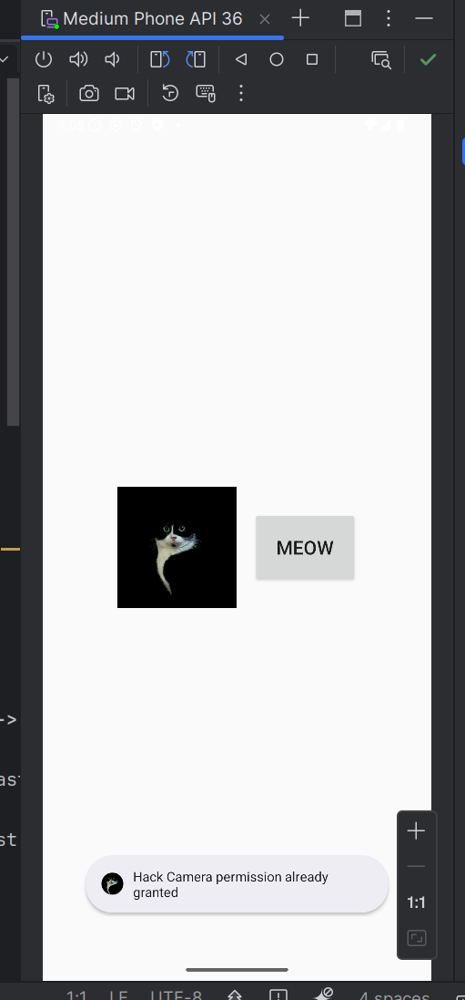

\newpage
\subsection{9. mobile malware development trick. Android permissions. Simple Android (Java/Kotlin) example.}

﷽

{height=400px}    

In this section, we will discuss how to handle permissions in Android, particularly focusing on the `CAMERA` permission using modern `ActivityResultContracts`. Permissions are a crucial aspect of Android security, as they allow or deny access to sensitive resources like the camera, microphone, or location services.     

Let's dive into the code example based on the Camera permission request to understand how this works in Android applications.     

### permissions in Android

In Android, permissions are used to restrict access to system resources that might affect user privacy or system stability. For example, the `CAMERA` permission allows an app to access the device's camera hardware.      

There are two main types of permissions in Android:

- *Normal Permissions* - these do not affect user privacy and are automatically granted by the system (e.g., `INTERNET`)      

- *Dangerous Permissions* - these could affect the user’s privacy or security, so they must be explicitly granted by the user (e.g., `CAMERA`, `LOCATION`, `READ_CONTACTS`).      

So few words about modern permissions handling in Android (ActivityResultContracts). Android has shifted to a more modern way of handling permissions using the [ActivityResultContracts API](https://developer.android.com/reference/androidx/activity/result/contract/ActivityResultContracts). This allows for cleaner and more flexible management of permissions. In this example, we'll use ActivityResultContracts.RequestPermission to request and handle the `CAMERA` permission.     

### permissions in Manifest file

In Android, permissions are declared in the `AndroidManifest.xml` file. This file is essential because it tells the system which resources the app intends to use, such as the camera, location services, or internet access. For our example, where we are requesting `CAMERA` permission, we need to declare it in the `AndroidManifest.xml`.    

To use the camera in an Android app, you must declare the `CAMERA` permission in the manifest file. Starting with `Android 6.0 (API level 23)`, apps also need to request permissions at runtime, as shown in the Kotlin code example, in addition to declaring the permission in the manifest.     

Here's how you would declare the `CAMERA` permission in the `AndroidManifest.xml`:     

```xml
<?xml version="1.0" encoding="utf-8"?>
<manifest xmlns:android="http://schemas.android.com/apk/res/android"
    xmlns:tools="http://schemas.android.com/tools">

    <uses-feature
        android:name="android.hardware.camera"
        android:required="false" />
    <uses-permission android:name="android.permission.CAMERA"/>

    <application
        android:allowBackup="true"
        android:dataExtractionRules="@xml/data_extraction_rules"
        android:fullBackupContent="@xml/backup_rules"
        android:icon="@mipmap/ic_launcher"
        android:label="@string/app_name"
        android:roundIcon="@mipmap/ic_launcher_round"
        android:supportsRtl="true"
        android:theme="@style/Theme.HackCam"
        tools:targetApi="31">
        <activity
            android:name=".MainActivity"
            android:exported="true"
            android:label="@string/app_name"
            android:theme="@style/Theme.HackCam">
            <intent-filter>
                <action android:name="android.intent.action.MAIN" />

                <category android:name="android.intent.category.LAUNCHER" />
            </intent-filter>
        </activity>
    </application>

</manifest>
```

As you can see, we need at least this line:     

```xml
<uses-permission android:name="android.permission.CAMERA"/>
```

This line declares that your app needs permission to use the camera. This is a normal permission that Android requires to grant access to the camera hardware.    

For `Android 10` and later, additional permissions might be needed for accessing external storage if you're saving or reading media files from the device. In such cases, you would also need to request `WRITE_EXTERNAL_STORAGE` and `READ_EXTERNAL_STORAGE` permissions, but that's not part of this simple example.     

```xml
<uses-permission android:name="android.permission.WRITE_EXTERNAL_STORAGE" />
<uses-permission android:name="android.permission.READ_EXTERNAL_STORAGE" />
```

However, starting from `Android 11 (API level 30)`, there is increased privacy with Scoped Storage, which restricts access to external storage, requiring apps to use more specific APIs (like `MediaStore` for photos and videos). This is not required for this specific camera permission example.     

I will show another permissions in the future sections of this book.    

### practical example

Let me show you simple example code: handling camera permission request in Android.     

Your project looks like there (`HackCam`):     

{width="80%"}       

How it works? First of all checking permission logic: when the app starts, the `checkCameraPermission()` function is called:     

```kotlin
override fun onCreate(savedInstanceState: Bundle?) {
    super.onCreate(savedInstanceState)
    setContentView(R.layout.activity_main)

    checkCameraPermission()  // check permission when the app starts

    cameraButton = findViewById(R.id.camButton)  // button to trigger camera permission check

    cameraButton.setOnClickListener {
        checkCameraPermission()  // check permission on button click
    }
}
```

If the `CAMERA` permission is already granted, the app will show a Toast saying that the permission is granted.      

If the `CAMERA` permission is not granted, it will request the permission from the user using `requestPermissionLauncher.launch()`.     

```kotlin
private fun checkCameraPermission() {
    when {
        ContextCompat.checkSelfPermission(this, android.Manifest.permission.CAMERA) == PackageManager.PERMISSION_GRANTED -> {
            // permission is already granted
            Toast.makeText(this, "Hack Camera permission already granted", Toast.LENGTH_SHORT).show()
        }
        else -> {
            // request permission if not granted
            requestPermissionLauncher.launch(android.Manifest.permission.CAMERA)
        }
    }
}
```

Checking Permission with `ContextCompat` logic: `ContextCompat.checkSelfPermission` checks if the app already has permission to access the camera. If the permission is granted, the app can proceed with using the camera. If the permission is not granted, we request it using the `ActivityResultLauncher`:     

```kotlin
private val requestPermissionLauncher = registerForActivityResult(
    ActivityResultContracts.RequestPermission()) { isGranted: Boolean ->
        if (isGranted) {
            Toast.makeText(this, "Hack Camera permission granted", Toast.LENGTH_SHORT).show()
        } else {
            Toast.makeText(this, "Hack Camera permission denied", Toast.LENGTH_SHORT).show()
        }
}
```

The `cameraButton` can be clicked multiple times to trigger the permission check again.     

### why use ActivityResultContracts?

In previous Android versions, permissions were requested and handled using `requestPermissions()` and `onRequestPermissionsResult()`. However, with `ActivityResultContracts`, Android has introduced a more streamlined and modern approach for managing permissions.      

Benefits of ActivityResultContracts:

*Cleaner Code:* - the API provides a more straightforward way of handling permission requests and results.    

*Separation of Concerns:* - the result handler is separated from the logic that triggers the permission request.     

*Flexible:* - you can handle permissions for different types of requests (e.g., location, camera, etc.) using different contracts.    

But in future examples i will use third party kotlin libraries (from github also) to request permissions.     

Full source code looks like this:    

```kotlin
package com.example.hackcam

import android.content.pm.PackageManager
import android.os.Bundle
import android.widget.Button
import android.widget.Toast
import androidx.activity.ComponentActivity
import androidx.activity.result.contract.ActivityResultContracts
import androidx.core.content.ContextCompat

class MainActivity : ComponentActivity() {
    private lateinit var cameraButton: Button

    // activity result launcher to request permission
    private val requestPermissionLauncher = registerForActivityResult (
        ActivityResultContracts.RequestPermission()) {isGranted: Boolean ->
            if (isGranted) {
                Toast.makeText(this, "Hack Camera permission granted", Toast.LENGTH_SHORT).show()
            } else {
                Toast.makeText(this, "Hack Camera permission denied", Toast.LENGTH_SHORT).show()
            }
    }

    // checking cam permission
    private fun checkCameraPermission() {
        when {
            ContextCompat.checkSelfPermission(this, android.Manifest.permission.CAMERA) == PackageManager.PERMISSION_GRANTED -> {
                // permission is granted
                Toast.makeText(this, "Hack Camera permission already granted", Toast.LENGTH_SHORT).show()
            } else -> {
                requestPermissionLauncher.launch(android.Manifest.permission.CAMERA)
            }
        }
    }

    override fun onCreate(savedInstanceState: Bundle?) {
        super.onCreate(savedInstanceState)
        setContentView(R.layout.activity_main)

        checkCameraPermission()
        cameraButton = findViewById(R.id.camButton)

        cameraButton.setOnClickListener {
            checkCameraPermission()
        }
    }
}
```

To test this example, we can install on the real device or just use virtual device:     

{width="80%"}       

{width="80%"}       

### demo

Install the app on an Android device:     

{height="30%"}       

When the app starts, it will automatically check if the `CAMERA` permission is granted:     

{width="80%"}       

If not granted, it will prompt the user to grant permission.      

Clicking the `Meow` button will recheck the permission status and notify the user if the permission is granted or denied:     

{height="30%"}       

As you can see, everything is worked as expected! =^..^=     

Managing permissions in Android is a crucial part of building secure and user-friendly applications. The new `ActivityResultContracts` API simplifies the process of requesting and handling permissions. In this example, we showed how to request the `CAMERA` permission, handle the result, and provide feedback to the user with Toast messages. This approach works seamlessly with modern Android development, ensuring a better user experience and cleaner code.     

In the following simple examples I will show how attackers can steal data from a user's device with their consent.     

I hope this section with practical example is useful for entry level Android software engineers.    

[ActivityResultContracts API](https://developer.android.com/reference/androidx/activity/result/contract/ActivityResultContracts)     